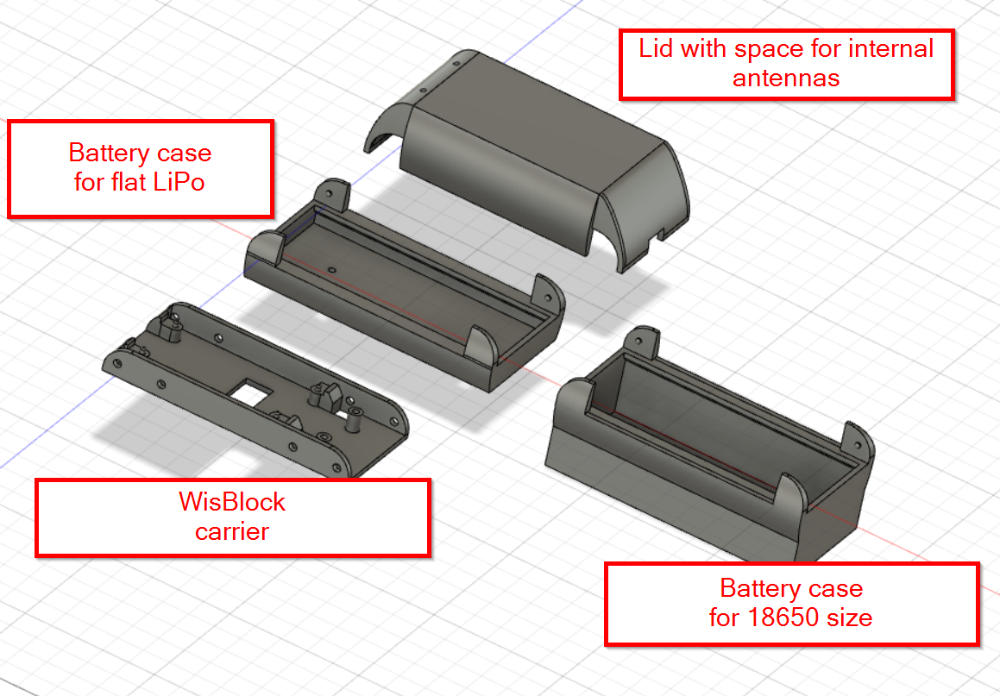
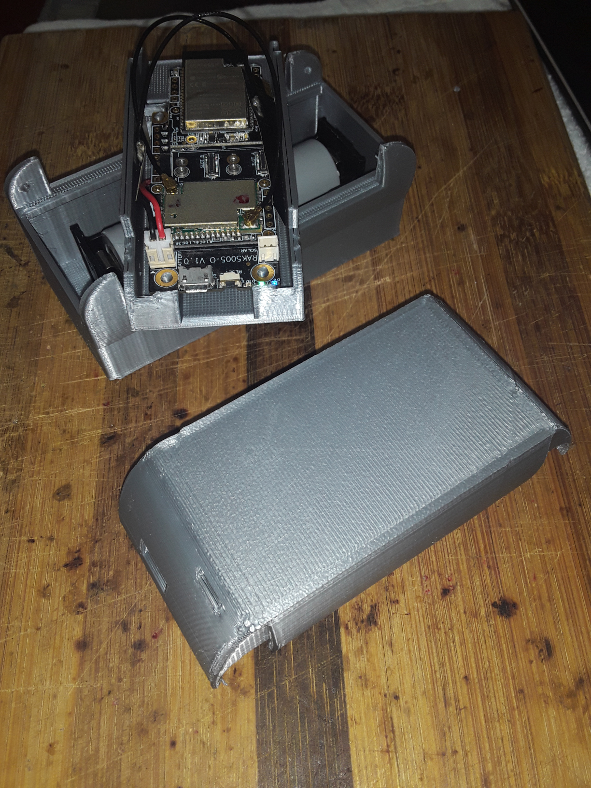
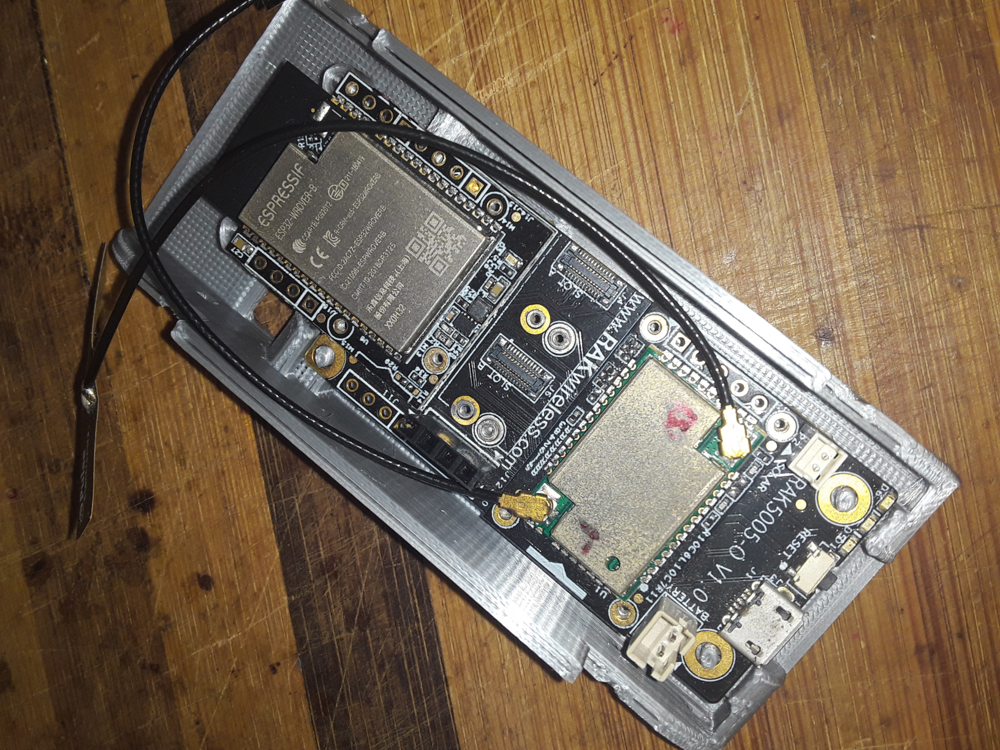
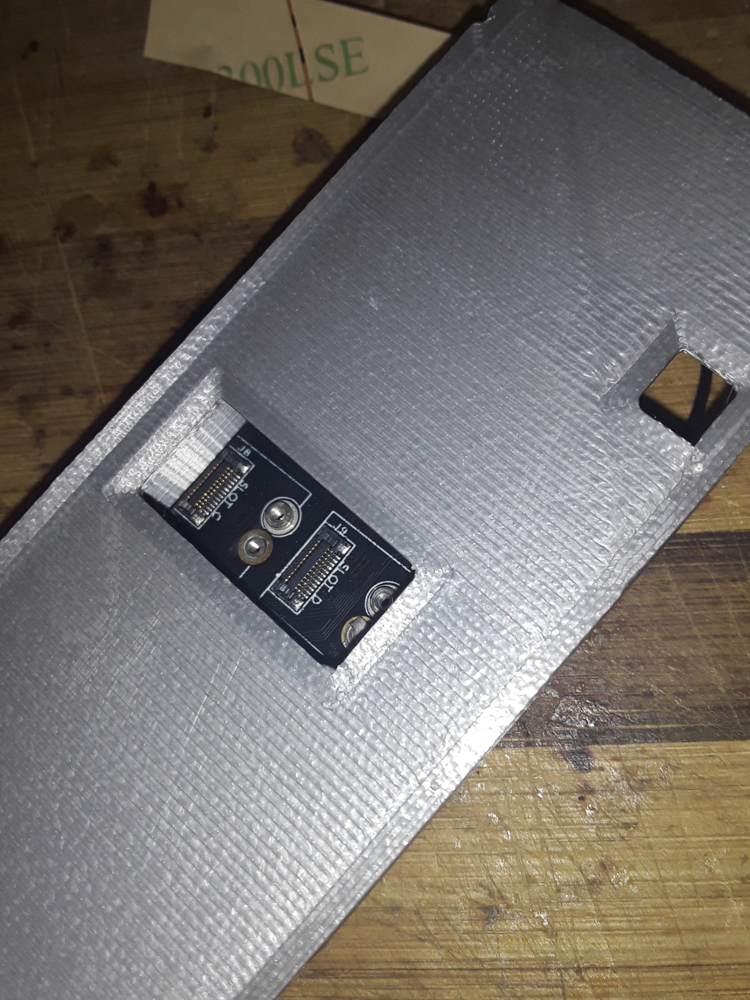
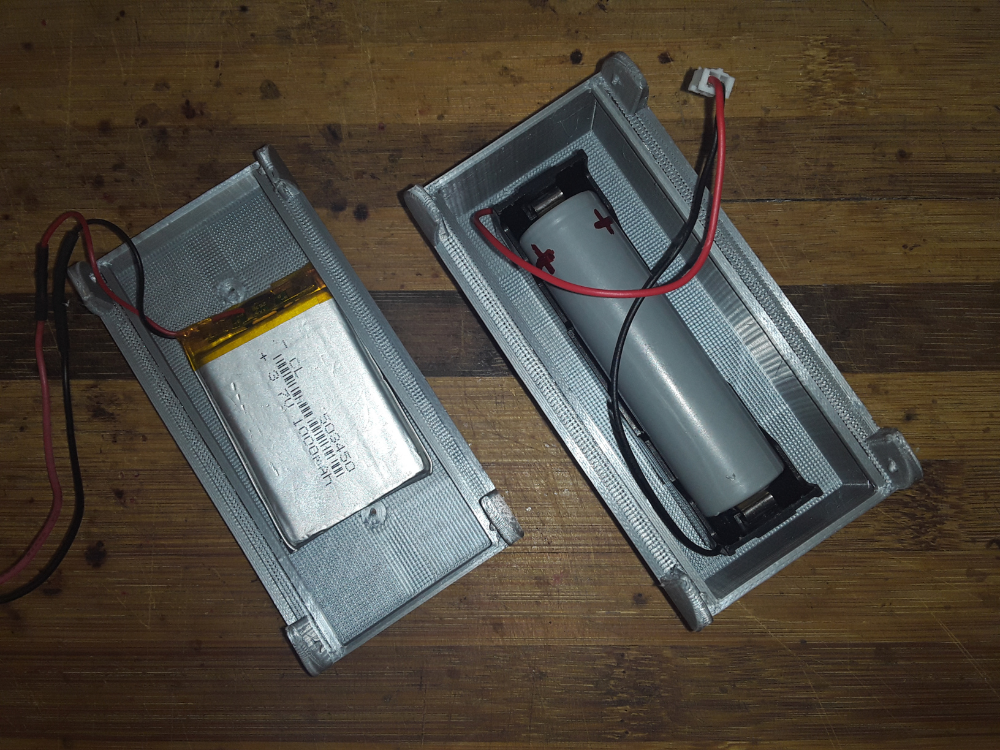
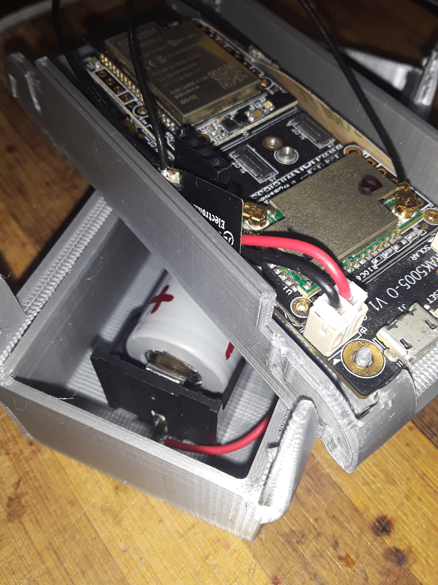
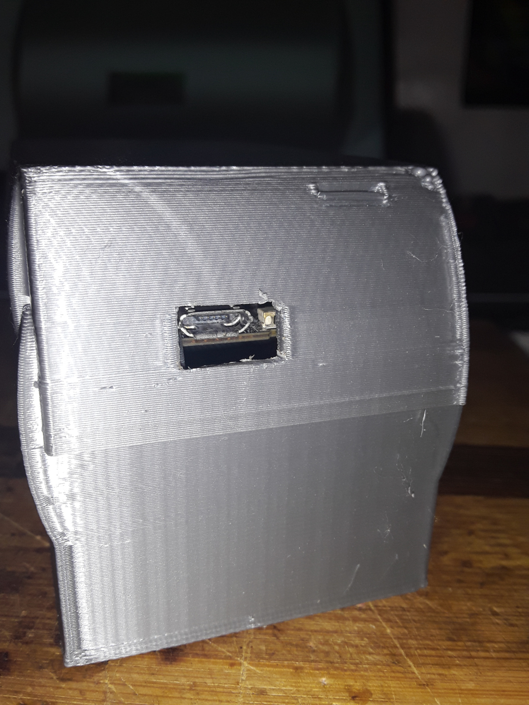
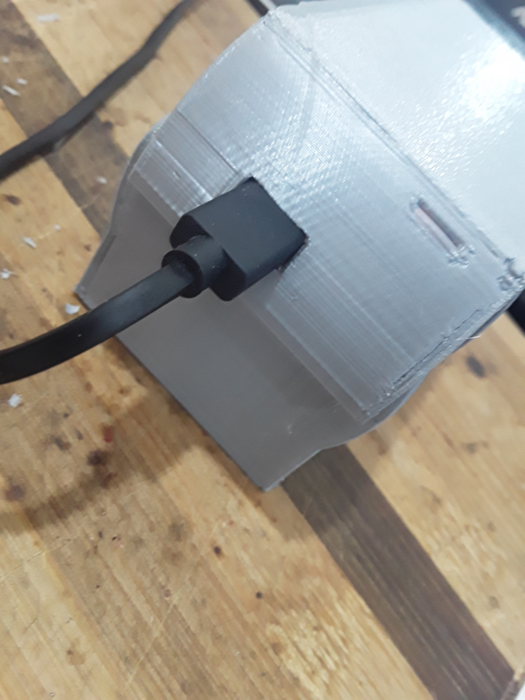
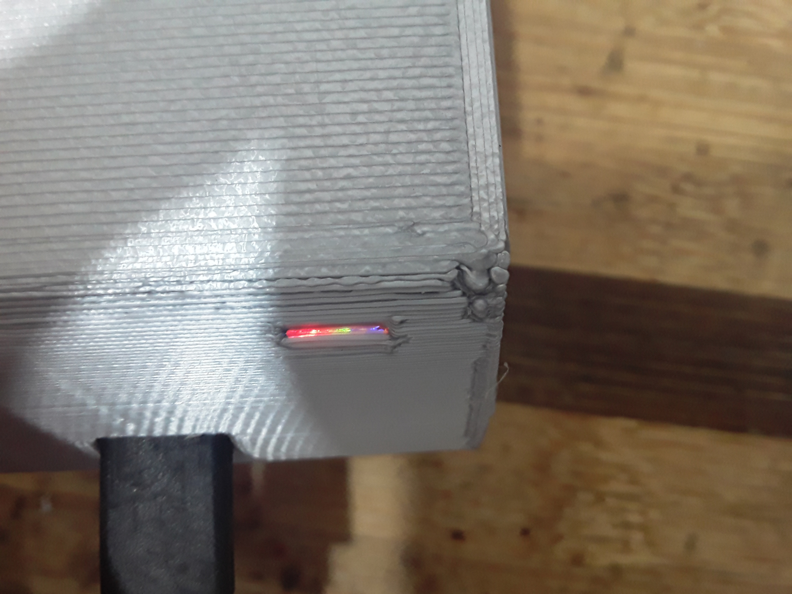
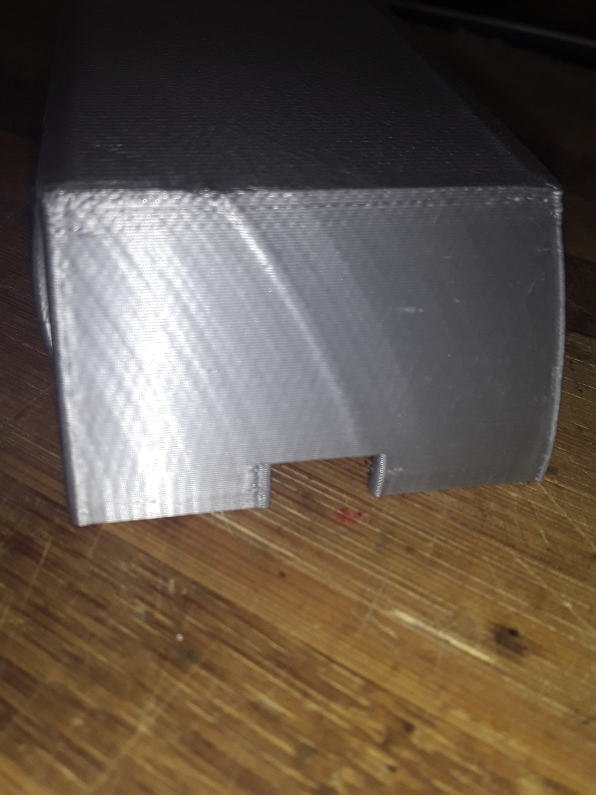

# Modular Evaluation Enclosure
This enclosure is perfect during the development phase.  

----

----

## Design files
The 3D design files can be found in the [3D-Design](./3D-Design) folder.    

Available formats:  
- Fusion 360 (.f3z)
- Object format (.obj)
- Sketchup format (.skp)
- SMT format (.smt)
- Step format (.step)    

Exported STL files for loading into your slicer are in the [STL](./STL) folder.

For a longer lasting solution, an additional design that uses screws to keep the enclosure modules together, can be found in the [Screw-Version](../Screw-Version) folder.

----

## Design details

The WisBlock carrier case gives easy access to all Sensor and IO slots, and at the same time, keeps your WisBlock protected.  

----

    

----

The carrier case is big enough to hold your WisBlock Base and the largest WisBlock IO modules.    

----
    

----
It allows easy access to the Sensor slots located at the bottom of the WisBlock Base.    

----
    

----

For battery powered solutions, you can choose between two different battery clip-on cases: One for an 18650 battery and a smaller one for a flat Li-Ion battery.     

----
    

----

The WisBlock base carrier has an opening guide for battery wires. This allows connection from the battery case to the carrier case.

----
    

----

For outdoor tests, a clip-on lid is available.    

----
    

----

The lid allows easy access to the USB port. A small opening is also made to see the on-board LEDs.     

----
|  |  |
| :-: | :-: |    

----

If you are using external sensors connected to a WisBlock IO module, a small opening in the lid allow wires to exit from the enclosure.    

----
    

----

