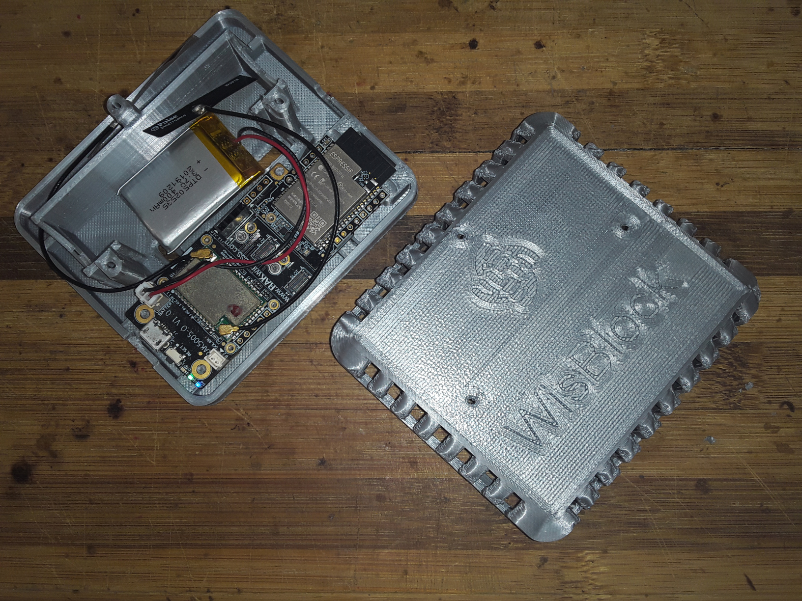

# Indoor Enclosure
This enclosure was inspired by the [RAKBox-B3](https://docs.rakwireless.com/Product-Categories/Accessories/RAKBox-B3). The problem with the RAKBox-B3 is that it is too small to allow the usage of WisBlock IO modules.      
This indoor enclosure here has a slightly larger footprint to allow the use of any WisBlock IO module. But with a different mounting system for the WisBlock Base board it has a lower build. In addition it offers a small opening for external sensors or actuators.  

----

----

The 3D design files can be found in the [3D-Design](./3D-Design) folder.    

Available formats:  
- Fusion 360 (.f3z)
- Object format (.obj)
- Sketchup format (.skp)
- SMT format (.smt)
- Step format (.step)    

Exported STL files for loading into your slicer are in the [STL](./STL) folder.

## Design details
The enclosure is assembled with screws. The body part has mounting points for the WisBlock Base module and the larger WisBlock IO modules.     
There is also an option to hold a 18650 battery.  

----

----

The opening for the USB port is closed when the lid is mounted, but the design can be easily adapted to keep the USB port accessible all the time.

----

----

A small opening near the WisBlock IO module allows to connect external sensors or actuators to the indoor enclosure.  

----

----

The engraved RAK symbol and WisBlock text is not very well printed. You might just leave it out for a better look.

----

----

  

