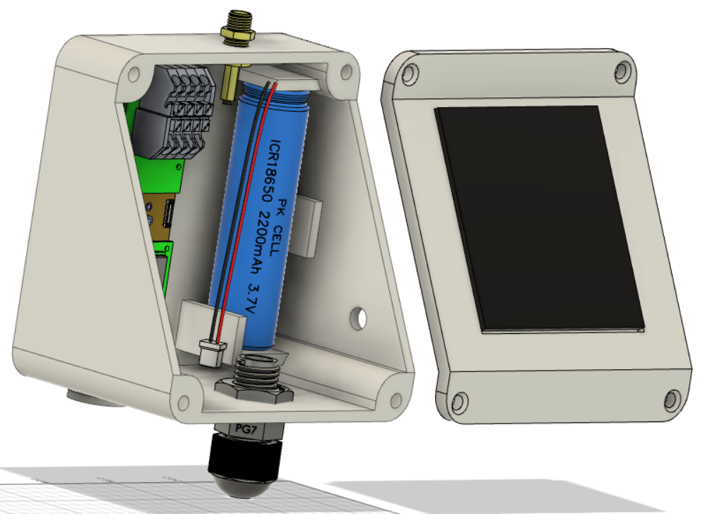
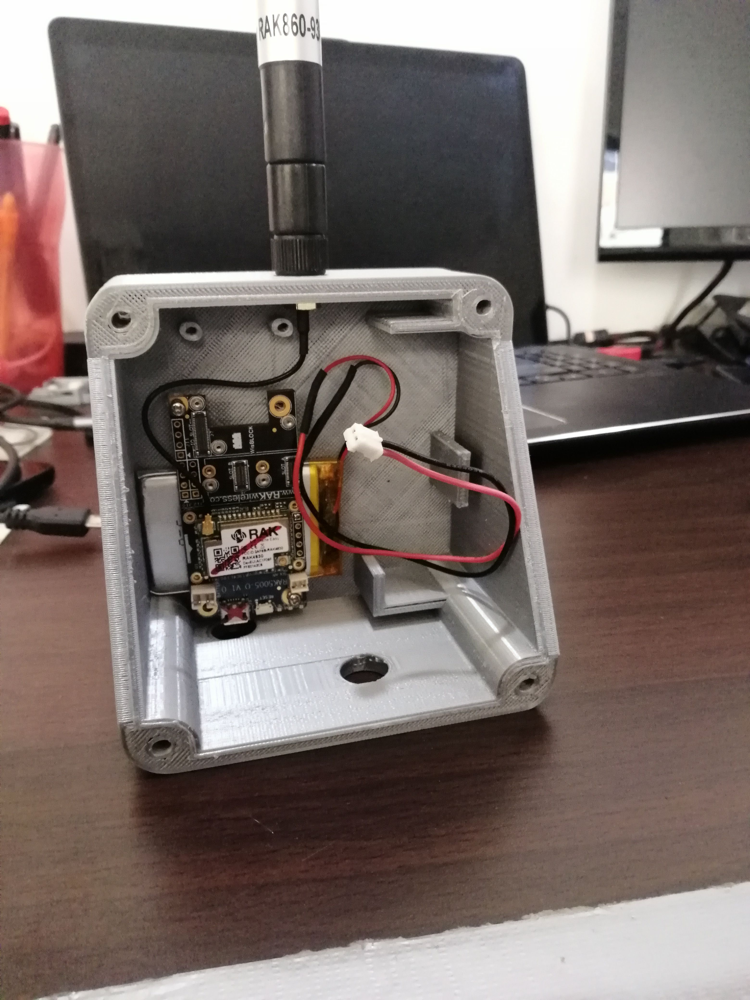
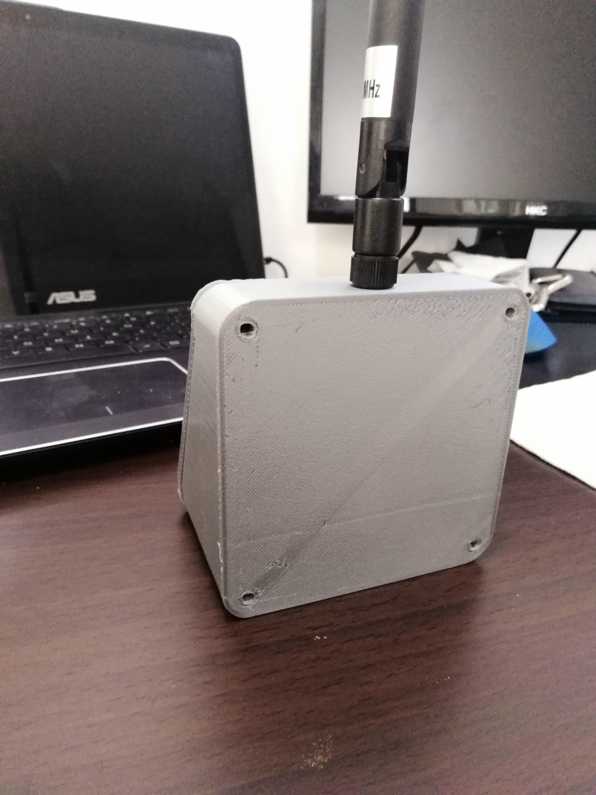
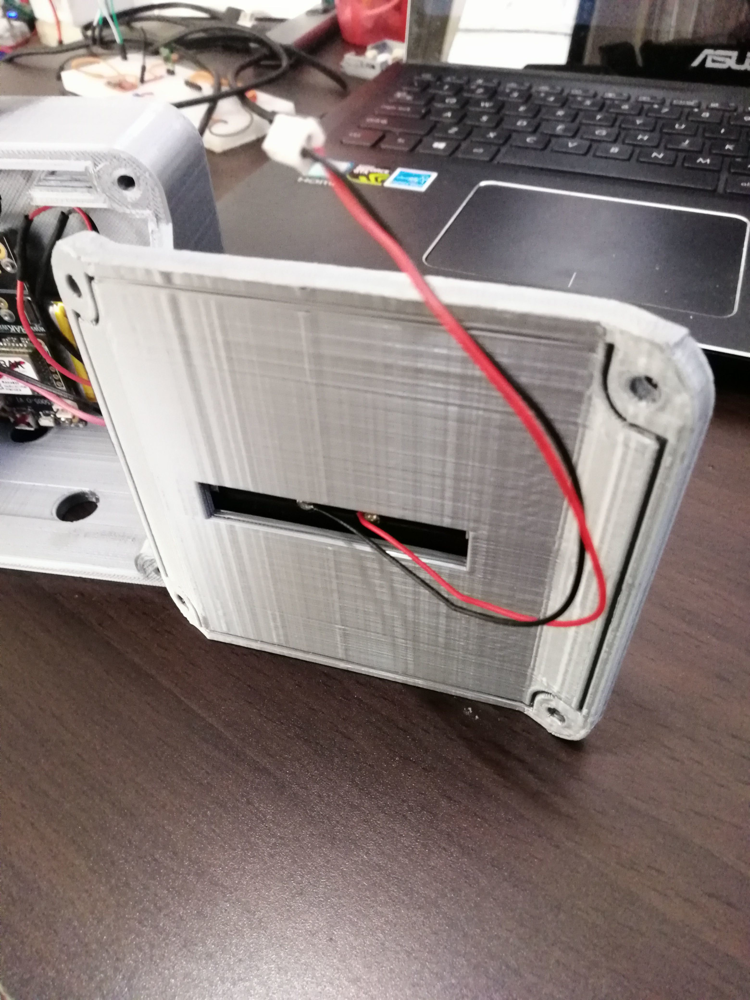
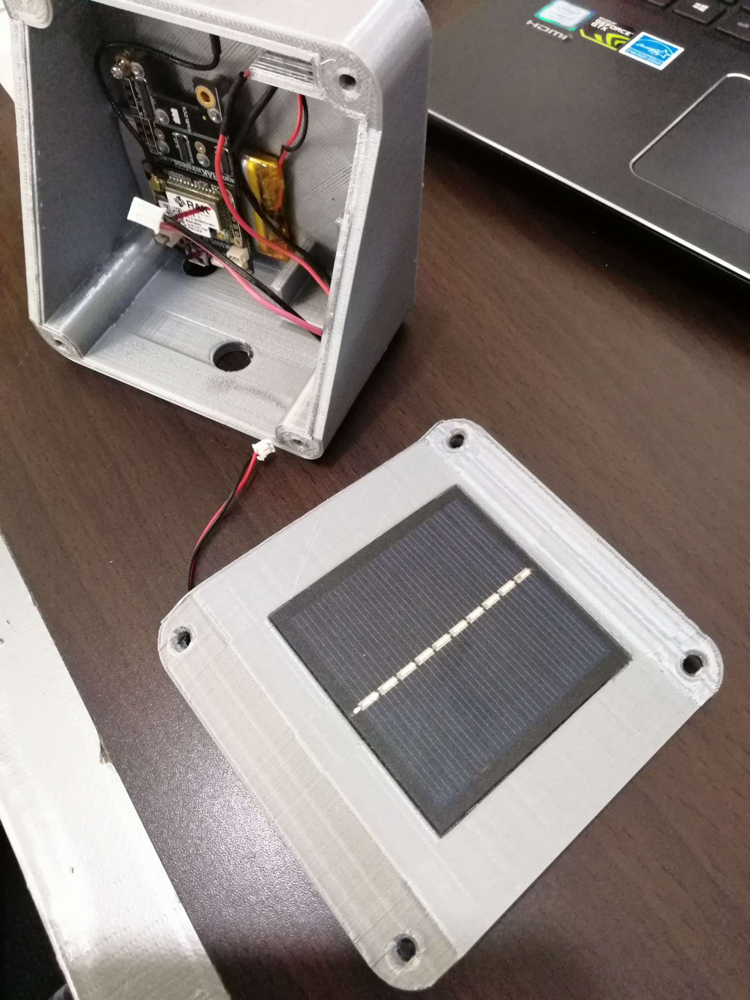
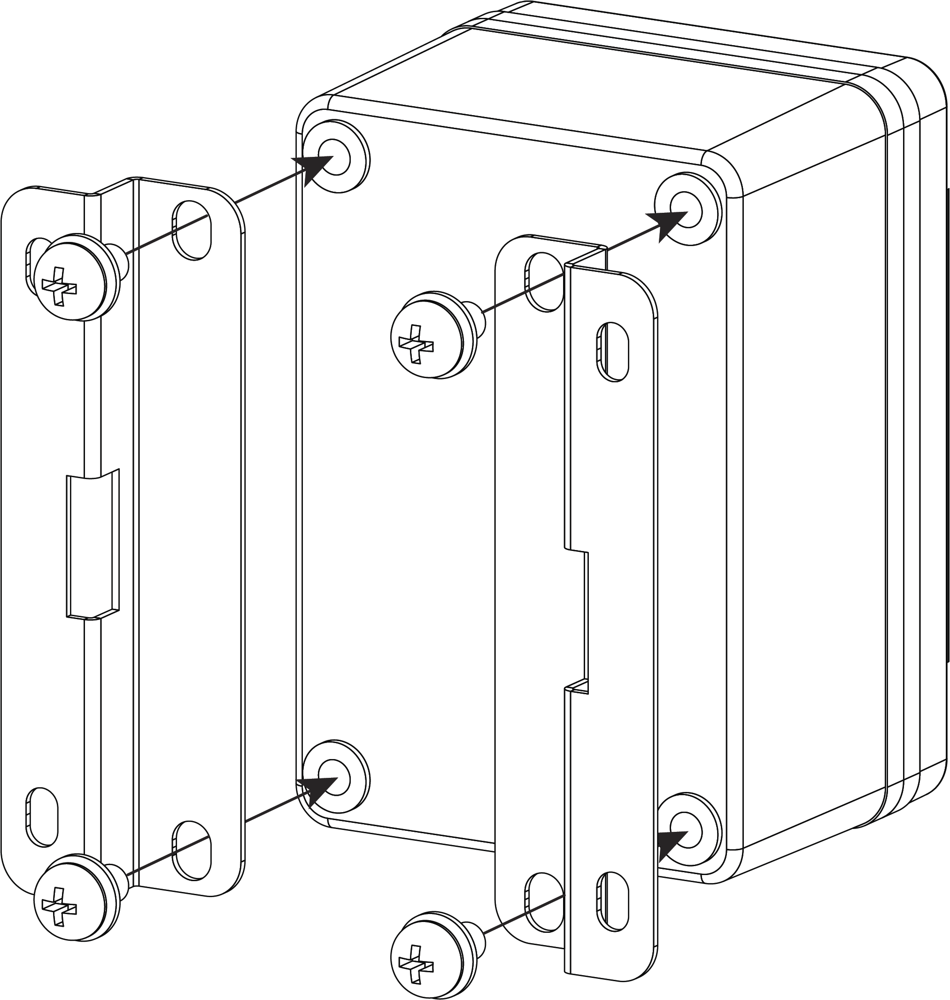
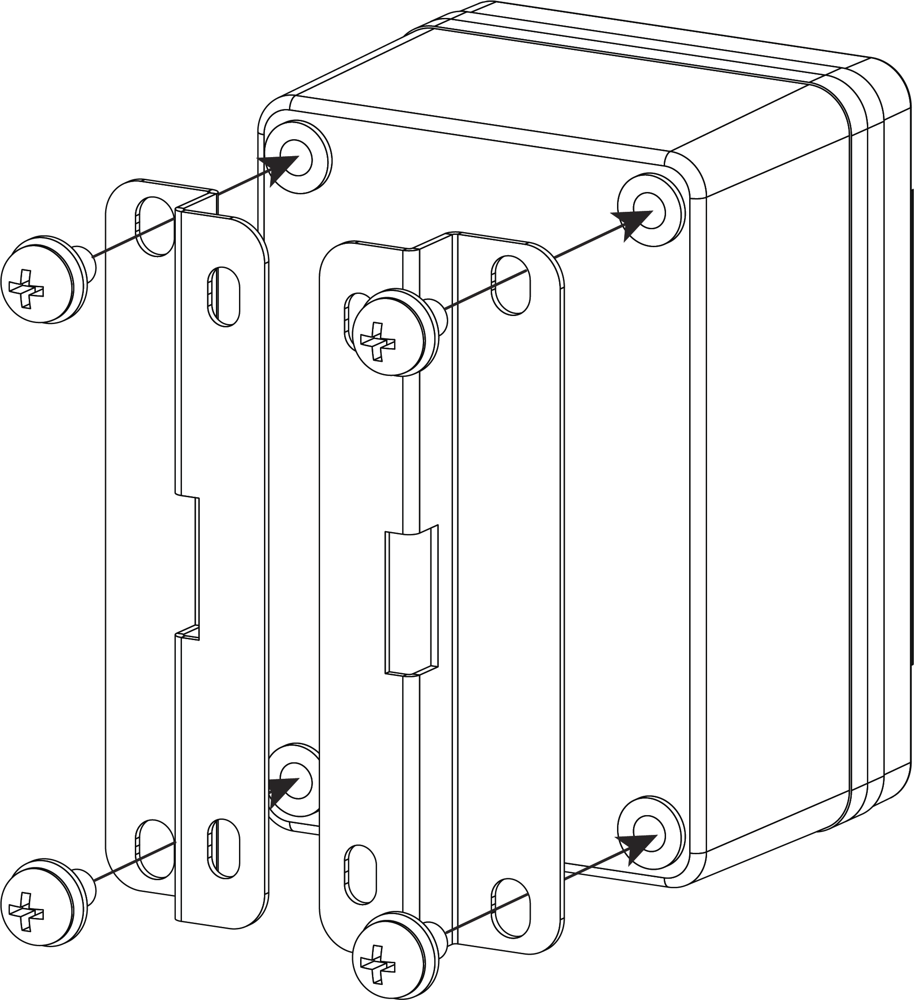
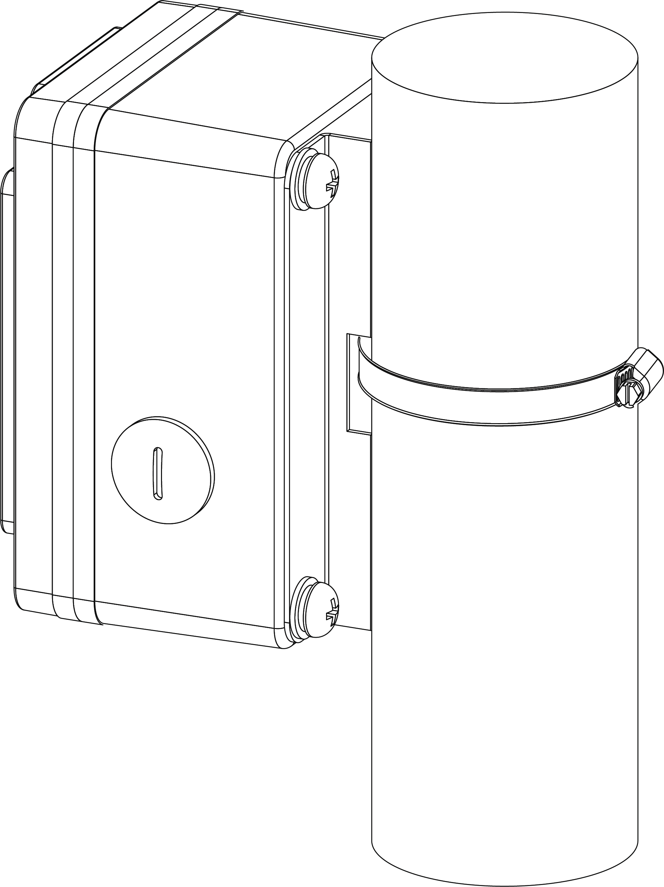

# Outdoor Enclosure with Solar Panel
This enclosure keeps your solution protected and charged with its Solar panel. Most outdoor enclosures with solar panels I saw have the problem that the solar panel is not pointing towards the sky, which limits the charging performance.     

----

----

## Design files
The 3D design files can be found in the [3D-Design](./3D-Design) folder.    
Available formats:  
- Fusion 360 (.f3z)
- Object format (.obj)
- Sketchup format (.skp)
- SMT format (.smt)
- Step format (.step)    

Exported STL files for loading into your slicer are in the [STL](./STL) folder.

----

## Design details
The body part of the enclosure has openings for    
- the antenna (it is advised to use a water-tight N-type antenna connector instead of the standard SMA connector in the design)
- a PG7 wire gland
- a small lid to access the USB port of the WisBlock    
- preparation for a 18650 battery holder, but as you can see in the picture, I put a flat Li-Ion battery for the test.

----

|  |  |
| :-: | :-: |

----

The top part has only the space to hold the solar panel. For a version without a solar panel, this space should be closed.  

----

|  |  |
| :-: | :-: |

## Mounting
The design supports the use of the same brackets used with the [RAKBox-B2](https://docs.rakwireless.com/Product-Categories/Accessories/RAKBox-B2) or [RAKBox-B4](https://docs.rakwireless.com/Product-Categories/Accessories/RAKBox-B4) enclosures. These brackets can be used for both wall or post mounting.

----

| Wall mount option | Pole mount option |
| :--: | :--: |
|  |  |
| |  |
