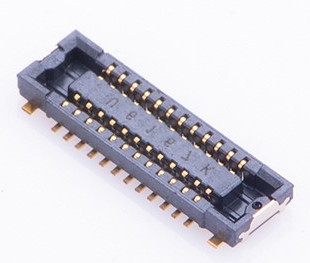
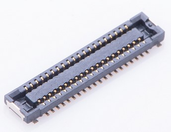

# Welcome to _**Awesome WisBlock**_ 

[RAKwireless WisBlock](https://docs.rakwireless.com/Product-Categories/WisBlock/) is open source. Not only the software is open source, but the hardware is as well.

To support you, we created the _**Awesome WisBlock**_ repository. Here you find tutorials how to create your own **WisBlock Sensor** or **WisBlock IO** modules.    

     
If you have created your own awesome IO or Sensor module, please share it here with the **WisBlock** community and become a **RAKstar**. And if it is something real awesome, RAKwireless might even produce it.
----

**Content**
- [Read this first](#read-this-first)
- [WisBlock Sensor tutorial](#wisblock-sensor-tutorial)
- [WisBlock IO tutorial](#wisblock-io-tutorial)
- [Board-to-boardconnectors](#board-to-board-connectors)
   - [Connector data sheets](#connector-data-sheets)
   - [Connector part library](#connector-part-library)
- [RAK examples](#rak-examples)
   - [RTC example](#rtc-example)
   - [IO extender example](#io-extender-example)
- [Community created modules](#community-created-modules)
   - Soon to come, all depends on you!

----

## Read this first
- The board-to-board connectors used in the WisBlock products can be bought from the [RAKwireless store](https://store.rakwireless.com). There are two suppliers for the connectors, Panasonic and TXGA. On the base board (RAK5005-O) are the female/socket version, on the modules are the male/header version      
- Have a good look into the datasheet of the RAK5005-O WisBlock Base board to understand the signals connected to the 4 sensor slots. => [RAK5005-O datasheet](https://docs.rakwireless.com/Product-Categories/WisBlock/RAK5005-O/Datasheet/)    
- Have a good look into the datasheet of one of the existing WisBlock Sensor modules to understand the usage of the signals. For example the [RAK1906 Environment sensor](https://docs.rakwireless.com/Product-Categories/WisBlock/RAK1906/Datasheet/)    
- Have a good look into the datasheet of one of the existing WisBlock IO modules to understand the usage of the signals. For example the [RAK1920 Sensor Adapter](https://docs.rakwireless.com/Product-Categories/WisBlock/RAK1920/Datasheet/)    

----

## WisBlock Sensor tutorial
This tutorial leads you throught the steps to create your own WisBlock Sensor module. You can find the step-by-step tutorial [here](./WisBlockSensorTutorial.md)
To make the task easier, we have prepared a complete example project for Autodesk Eagle™. You can download it [here](./WisBlock-Sensor-Template.zip).

## WisBlock IO tutorial
This tutorial leads you throught the steps to create your own WisBlock IO module. You can find the step-by-step tutorial [here](./WisBlockIOTutorial.md)
To make the task easier, we have prepared a complete example project for Autodesk Eagle™. You can download it [here](./WisBlock-IO-Template.zip).

## Board-to-board connectors
| 24 Pin Male | 24 Pin Female |
| :--: | :--: |
|  |  |     
The board-to-board connectors used in the WisBlock products can be bought from the [RAKwireless store](https://store.rakwireless.com). There are two suppliers for the connectors, Panasonic and TXGA. On the base board (RAK5005-O) are the female/socket version, on the modules are the male/header version.      
There are two types of connectors. The 24pin male connector is used for WisBlock Sensor modules. The 40pin male connector is used for WisBlock IO modules.    
| 40 Pin Male | 40 Pin Female |
| :--: | :--: |
|  |  |    

### Connector data sheets
   - Panasonic connector [data sheet](https://www.panasonic-electric-works.com/pew/eu/downloads/ds_a4s_en.pdf)    
   - TXGA connector [female data sheet](https://tupian.txga.com/serials-attach/FBB04004-F/Drawing-FBB04004-F.pdf)    
   - TXGA connector [male data sheet](https://tupian.txga.com/serials-attach/FBB04004-M/Drawing-FBB04004-M.pdf)

### Connector part library
- Schematic and PCB part libraries for other PCB design tools than Eagle are available in the [Parts-Libraries](./PartsLibraries) 

## RAK examples
We prepared a custom WisBlock Sensor and a custom WisBlock IO module as ready to go Eagle™ projects.

### RTC example
This Eagle™ project is the outcome of the WisBlock Sensor tutorial. It is a RTC module with integrated backup battery.

### IO extender example
This Eagle™ project is the outcome of the WisBlock IO tutorial. It is an IO extender that gives you access to more GPIO's.

## Community created modules
This is your space. We hope that you share the _**awesome**_ WisBlock Sensor and WisBlock IO you created here with the community.    

----

Thank you for sharing your _**awesome**_ creation here and supporting RAKwireless by using our WisBlock products.    

**RAKwireless invests time and resources providing this open source code, please support RAKwireless and open-source hardware by purchasing products from [RAKwireless](https://rakwireless.com/)!**

_**For support and questions about RAKwireless products please visit our [forum](https://forum.rakwireless.com/)**_    
_**For examples and quick start tutorial please visit our [Github Repo](https://github.com/RAKWireless/Wisblock)**_    
_**For additional information about RAK products please visit our [Documentation Center](https://docs.rakwireless.com/) and our [Knowledge Hub](https://docs.rakwireless.com/Knowledge-Hub/Learn/)**_    
_**To buy WisBlock modules please visit our [online store](https://store.rakwireless.com/)**_    