# Shared 3D Print Enclosure Examples

| Image | MakerWorld Link | Thingiverse Link | Printables Link | Purpose | Supported WisBlock Modules |
| ----- | --------------- | ---------------- | --------------- | ------- |-------------------------- |
| 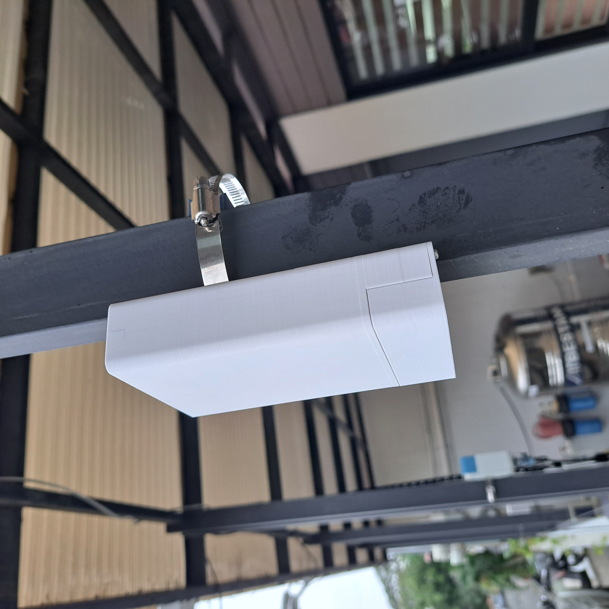 | [RAKwireless WisBlock Outdoor concept tall (Not published yet)]() | [RAKwireless WisBlock Outdoor concept tall (Not published yet)]() | [RAKwireless WisBlock Outdoor concept tall (Not published yet)]() | Rain proof outdoor enclosure. For large sized WisBlock setups and outdoor usage, e.g. Meshtastic Repeater, RS485 sensors, 4-20mA sensors  | All Core modules, RAK19007, RAK19001 |
| 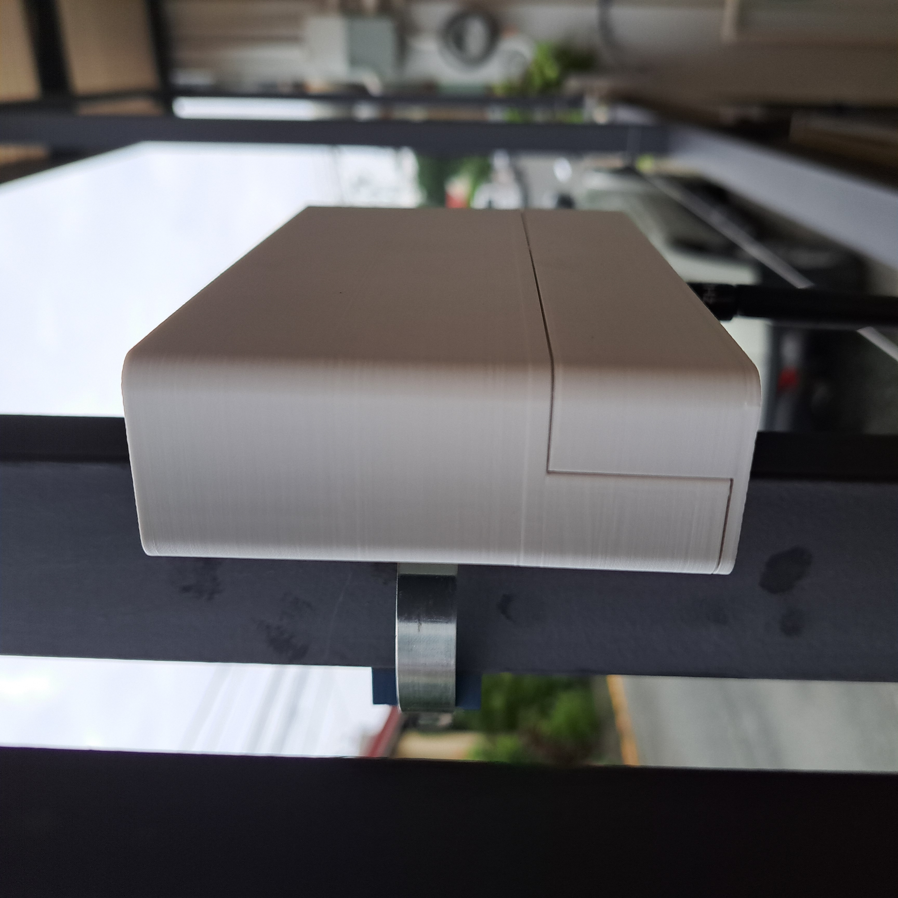 | [RAKwireless WisBlock Outdoor concept wide](https://makerworld.com/en/models/1650591-rakwireless-wisblock-outdoor-concept-wide#profileId-1745046) | [RAKwireless WisBlock Outdoor concept wide](https://www.thingiverse.com/thing:7105410#google_vignette) | [RAKwireless WisBlock Outdoor concept wide](https://www.printables.com/model/1370792-rak-wisblock-outdoor-concept-wide) | Rain proof outdoor enclosure. For medium sized WisBlock setups and outdoor usage, e.g. Meshtastic Repeater, RS485 sensors, 4-20mA sensors | All Core modules, RAK19007, RAK19001 |
| 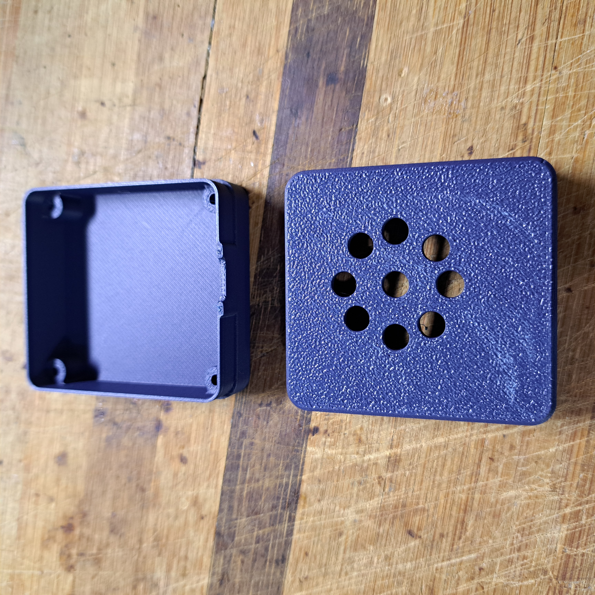 | [RAKwireless RAK19003 Mini Sensor Enclosure](https://makerworld.com/en/models/1647630-rakwireless-rak19003-mini-sensor-enclosure#profileId-1741595) | [RAKwireless RAK19003 Mini Sensor Enclosure](https://www.thingiverse.com/thing:7103749) |  [RAKwireless RAK19003 Mini Sensor Enclosure](https://www.printables.com/model/1369046-rakwireless-rak19003-mini-sensor-enclosure) | Small indoor sensor enclosure. Can host up to two small Sensor modules and battery | All Core modules, RAK19003, RAK1901, RAK1902, RAK1903, RAK1906, RAK12047 |
| 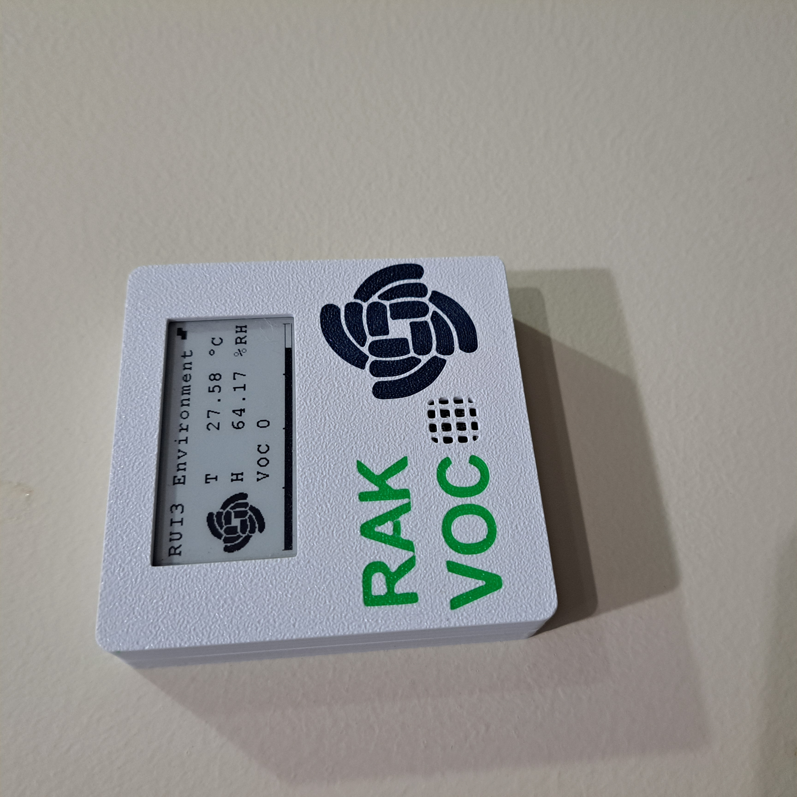 | [RAKwireless WisBlock IAQ Sensor With Display](https://makerworld.com/en/models/1625683-rakwireless-wisblock-iaq-sensor-with-display#profileId-1716457) | [RAKwireless WisBlock IAQ Sensor With Display](https://www.thingiverse.com/thing:7098935) | [RAKwireless WisBlock IAQ Sensor With Display](https://www.printables.com/model/1369070-rakwireless-wisblock-iaq-sensor-with-display) | Medium indoor sensor enclosure with display. Can host up to 4 Sensor Module | All Core modules, RAK19007, RAK14000, RAK1901, RAK1902, RAK1903, RAK1906, RAK12047, requires RAK19005 Sensor Extension Cable |
| 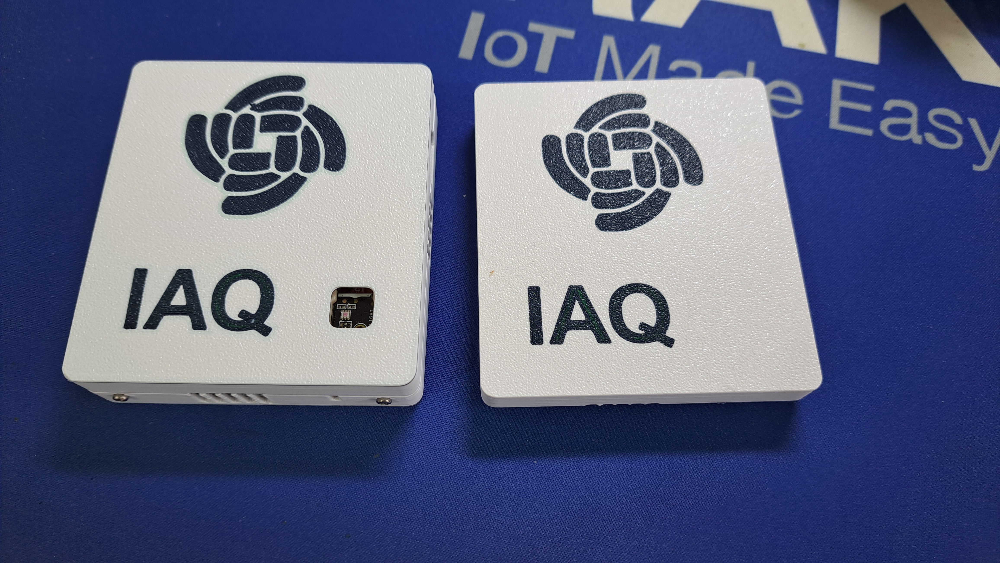 | [RAKwireless WisBlock Indoor IAQ sensor](https://makerworld.com/en/models/1628179-rakwireless-wisblock-indoor-iaq-sensor#profileId-1719243) | [RAKwireless WisBlock Indoor IAQ sensor](https://www.thingiverse.com/thing:7098944) | [RAKwireless WisBlock Indoor IAQ sensor](https://www.printables.com/model/1369073-rakwireless-wisblock-indoor-iaq-sensor) | Medium indoor sensor enclosure, Can host up to 4 Sensor and 1 IO sensor modules. | All Core modules, RAK19007, RAK1901, RAK1902, RAK1903, RAK1906, RAK12047, RAK12039, requires RAK19005 Sensor Extension Cable |
| 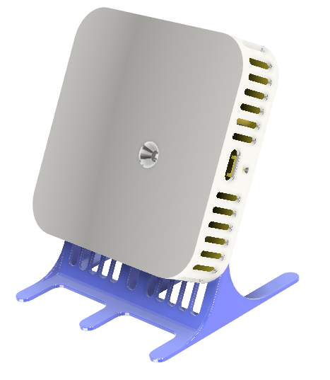 | [RAKwireless Home IAQ](https://makerworld.com/en/models/1643861-rakwireless-home-iaq#profileId-1737228) | [RAKwireless Home IAQ](https://www.thingiverse.com/thing:7103784) | [RAKwireless Home IAQ](https://www.printables.com/model/1369050-rakwireless-home-iaq) | Large indoor sensor enclosure, supports many sensor modules. Can host up to 6 Sensor and 2 IO sensor modules. | All Core modules, RAK1901, RAK1902, RAK1906, RAK1903, RAK12010, RAK12037, RAK12039, RAK12047, RAK19001 |
| 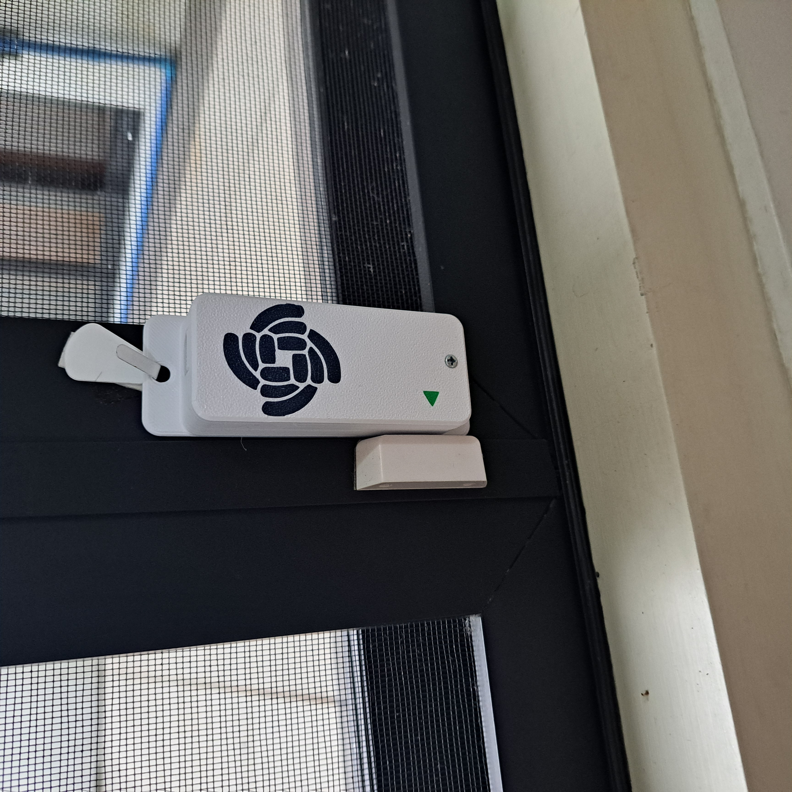 | [RAKwireless WisBlock RAK13011 Window & Door Alarm](https://makerworld.com/en/models/1625400-rakwireless-wisblock-rak13011-window-door-alarm#profileId-1716136) | [RAKwireless WisBlock RAK13011 Window & Door Alarm](https://www.thingiverse.com/thing:7098948) | [RAKwireless WisBlock RAK13011 Window & Door Alarm](https://www.printables.com/model/1369067-rakwireless-wisblock-rak13011-window-door-alarm) | Door/window alarm contact. Simple reed relay based door/window opening counter or alarm. | All Core modules, RAK19003, RAK19007, RAK13011 |
| 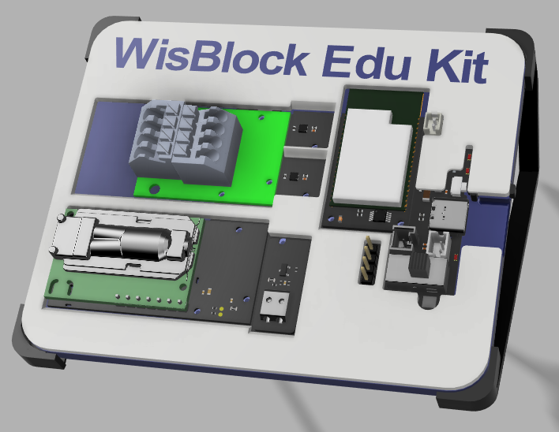 | [RAKwireless RAK19001 Edu Stand](https://makerworld.com/en/models/1638076-rakwireless-rak19001-edu-stand#profileId-1730584) | [RAKwireless RAK19001 Edu Stand](https://www.thingiverse.com/thing:7103791) | [RAKwireless RAK19001 Edu Stand](https://www.printables.com/model/1369052-rakwireless-rak19001-edu-stand) | Stand for RAK19001 Base Board with easy access to all module slot. For everyday WisBlock Explorers that want to build something new very often | All Core modules, RAK19001, all Sensor and IO modules |
| 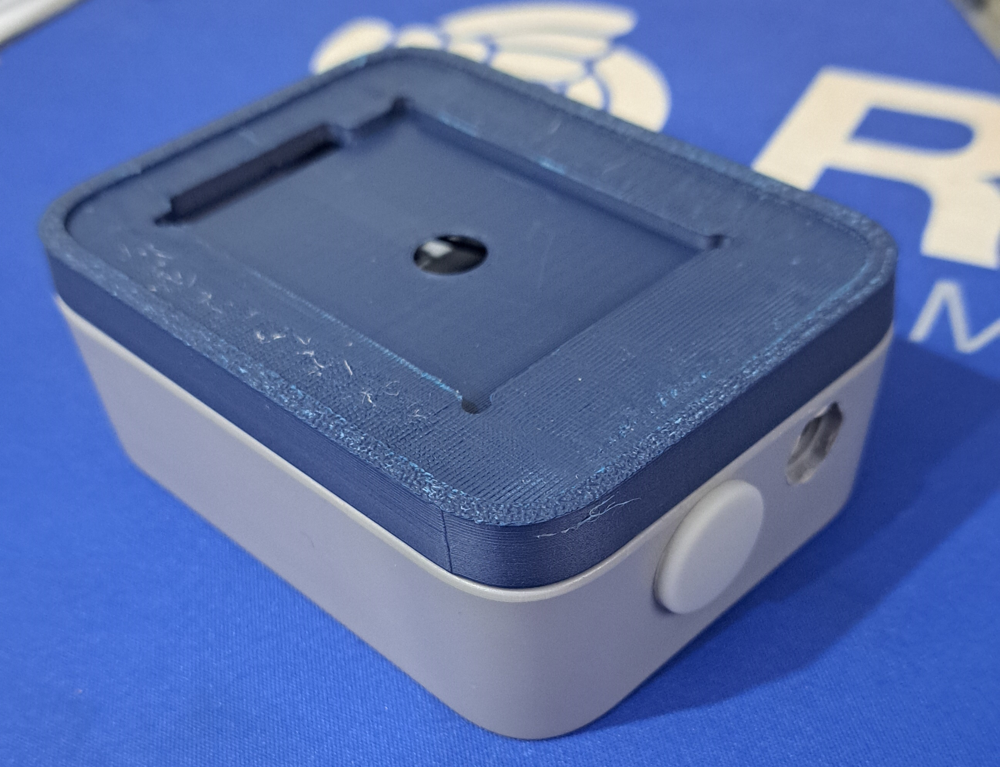 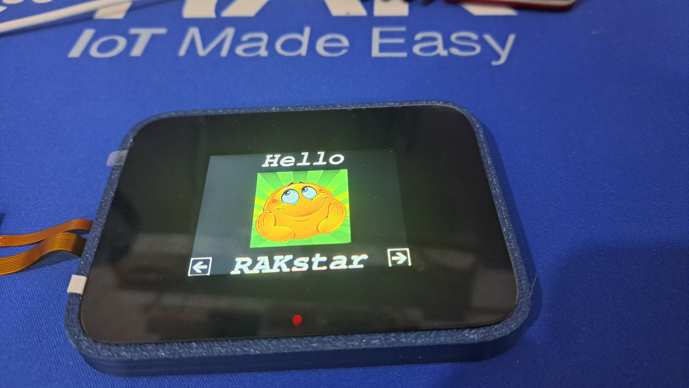 | [RAKwireless Unify Enclosure TFT Lid](https://makerworld.com/en/models/1634328-rakwireless-unify-enclosure-tft-lid#profileId-1726390) | [RAKwireless Unify Enclosure TFT Lid](https://www.thingiverse.com/thing:7103797) | [RAKwireless Unify Enclosure TFT Lid](https://www.printables.com/model/1369063-rakwireless-unify-enclosure-tft-lid) | 3D printed lid for Unify Enclosure 100 x 75 x 38 mm with preparation for the RAK14014 TFT-Touchscreen display | All Core modules, RAK19007, RAK14014 |
| 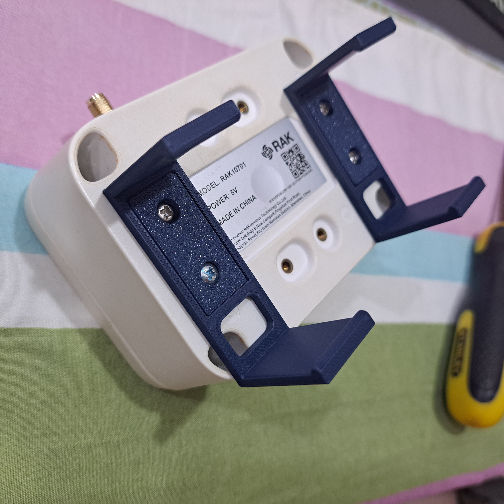 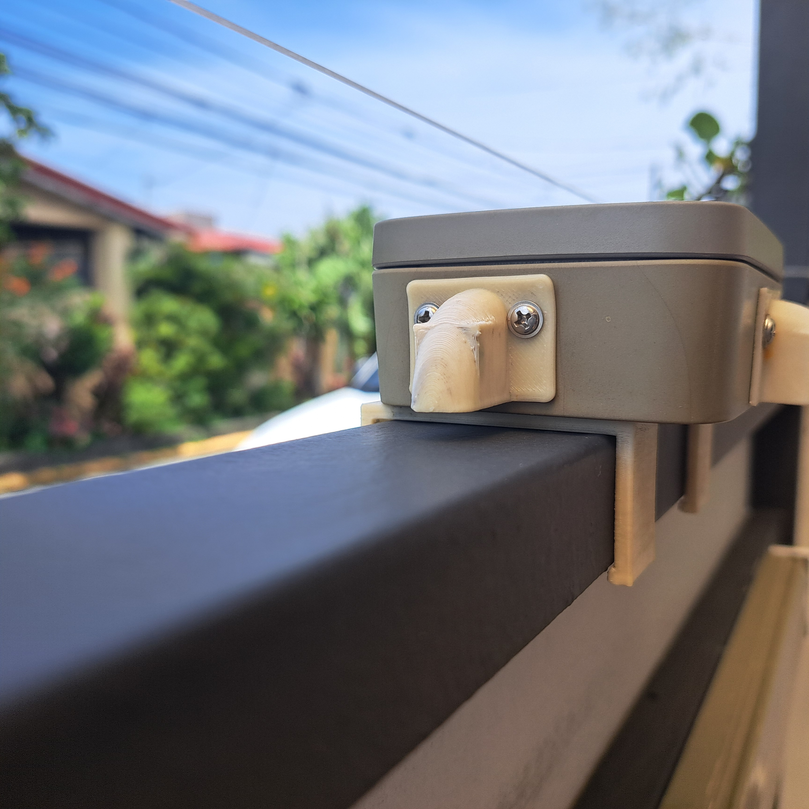 | [Unify Enclosure Fence Holder](https://makerworld.com/en/models/1655880-rak-unify-enclosure-mounting-accessory-1x2-rail#profileId-1751308) | [Unify Enclosure Fence Holder](https://www.thingiverse.com/thing:7105434) | [Unify Enclosure Fence Holder](https://www.printables.com/model/1370811-rak-unify-enclosure-mounting-accessory-1x2-rail) | 3D printed mounting accessory for Unify Enclosures | All Unify enclosures |
| 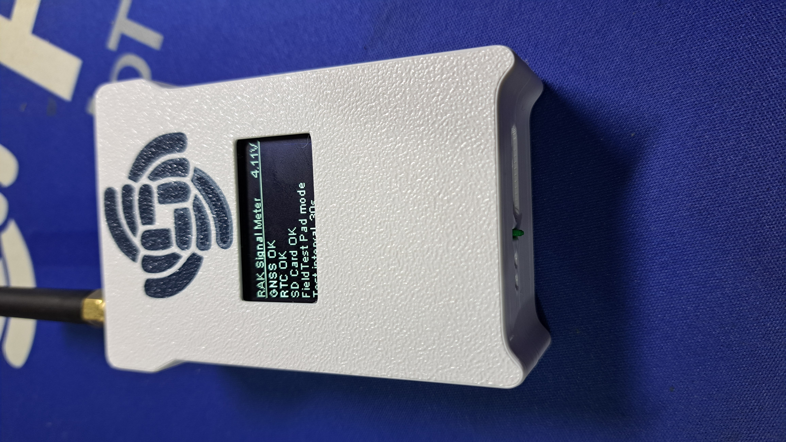 | [RAKwireless RAK10706 Signal Meter](https://makerworld.com/en/models/1628790-rakwireless-rak10706-signal-meter#profileId-1719959) | [RAKwireless RAK10706 Signal Meter](https://www.thingiverse.com/thing:7098961) | [RAKwireless RAK10706 Signal Meter](https://www.printables.com/model/1369115-rak10706-signal-meter) | Custom enclosure for the RAK19028 Base Board, includes already accelerometer and GNSS location chip. Used for RAK10706 Signal Meter or WisMesh Pocket V2. Can be used as well for custom devices based on the RAK19028 Base Board | RAK19028 with RAK4630 WisDuo module |
| 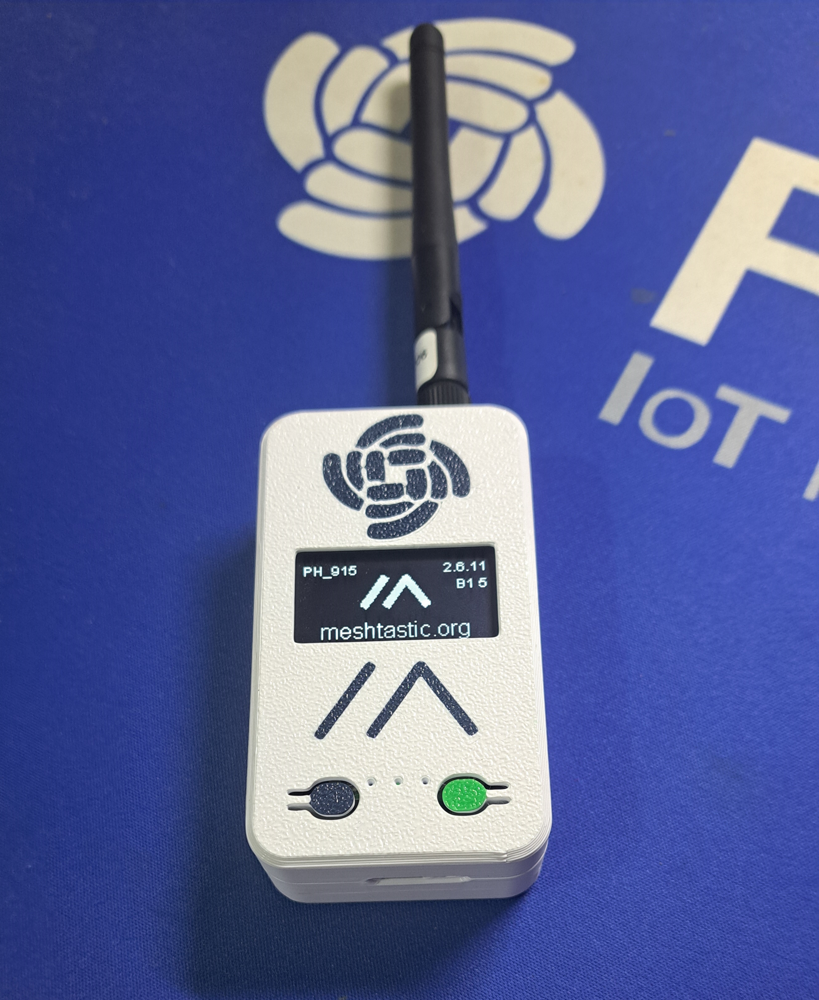 | [RAKwireless WisMesh Board ONE](https://makerworld.com/en/models/1631878-rakwireless-wismesh-board-one#profileId-1723640) | [RAKwireless WisMesh Board ONE](https://www.thingiverse.com/thing:7103796) | [RAKwireless WisMesh Board ONE](https://www.printables.com/model/1369061-rakwireless-wismesh-board-one) | Enclosure for the WisMesh Board ONE, can be used as a base for other custom usage of the Board ONE PCB | Board ONE with RAK4630 WisDuo module |

