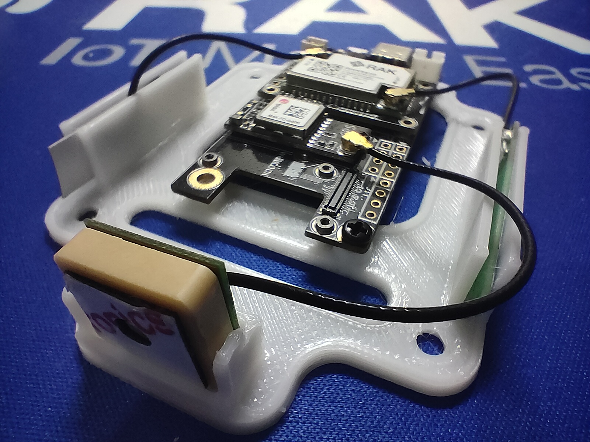
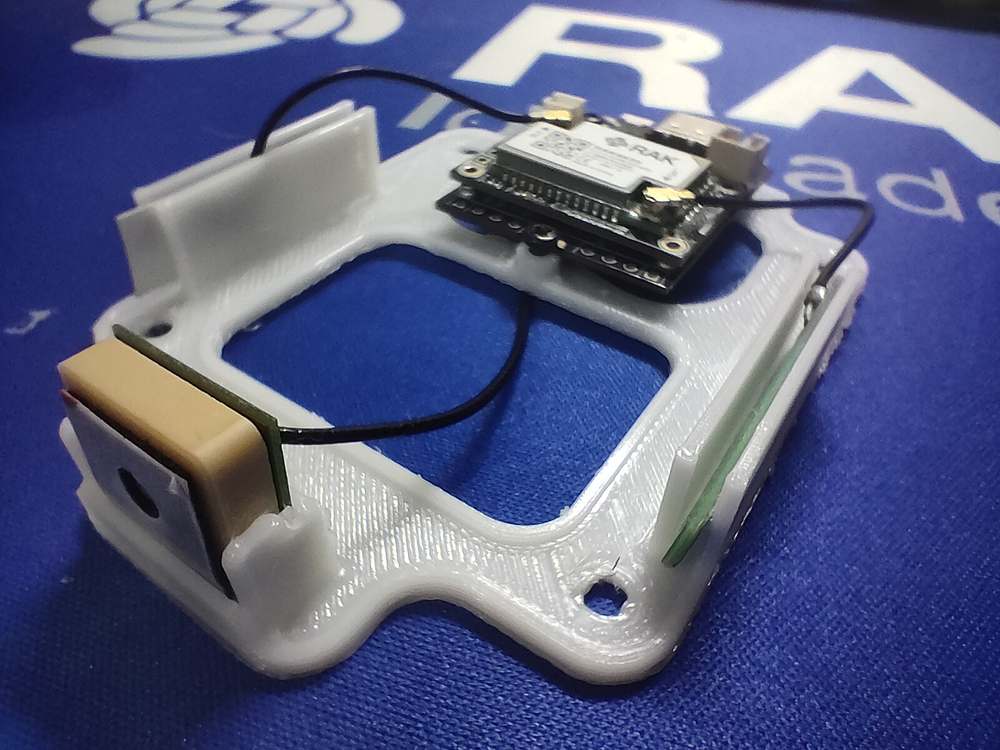

# Welcome to _**Awesome WisBlock Unified Enclosures**_ 

When you buy our awesome WisBlock Unified Enclosures, you can select matching mounting plates to mount your WisBlock Base Board and modules in the enclosures.    

But as usual, that's not where we stop .    
Often you need your very special mounting plate, be it to fix a battery or your antenna.    

To make it easier for you, we share here some ideas for mounting plates as well as blank plates that you can use as a template to create your own design.

----

**Content**     
- [Small Unified Enclosure](#small-unified-enclosure)
   - [Blank Base](#small-blank-base)
   - [GNSS location tracker base for RAK5005-O/RAK19007](#gnss-rak5005-o-rak19007)
   - [GNSS location tracker base for RAK19003](#gnss-rak19003)
- [Medium Unified Enclosure](#medium-unified-enclosure)
   - [Blank Base](#medium-blank-base)

----
|  |  |
| -- | -- |
|  |  |

----

----

Thank you for sharing your _**awesome**_ ideas here and supporting RAKwireless by using our WisBlock products.    

**RAKwireless invests time and resources providing this open source code, please support RAKwireless and open-source hardware by purchasing products from [RAKwireless](https://rakwireless.com/)!**

_**For support and questions about RAKwireless products please visit our [forum](https://forum.rakwireless.com/)**_    
_**For examples and quick start tutorial please visit our [Github Repo](https://github.com/RAKWireless/Wisblock)**_    
_**For additional information about RAK products please visit our [Documentation Center](https://docs.rakwireless.com/) and our [Knowledge Hub](https://docs.rakwireless.com/Knowledge-Hub/Learn/)**_    
_**To buy WisBlock modules please visit our [online store](https://store.rakwireless.com/)**_    