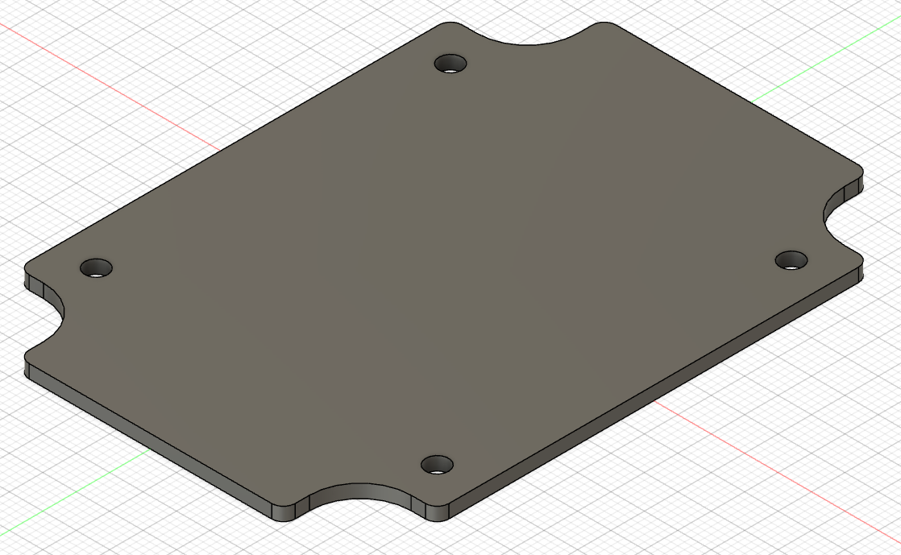
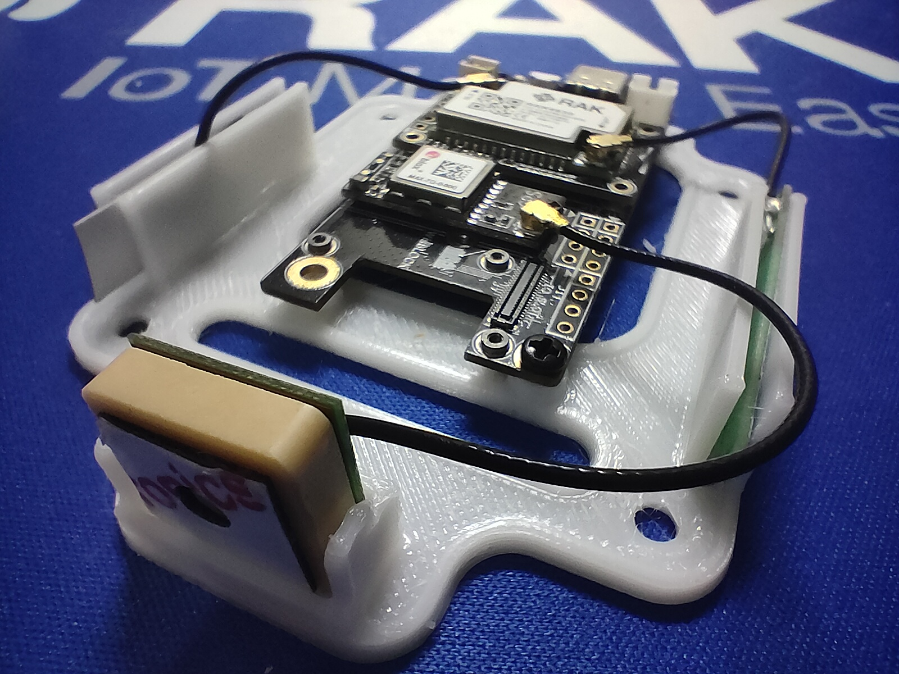
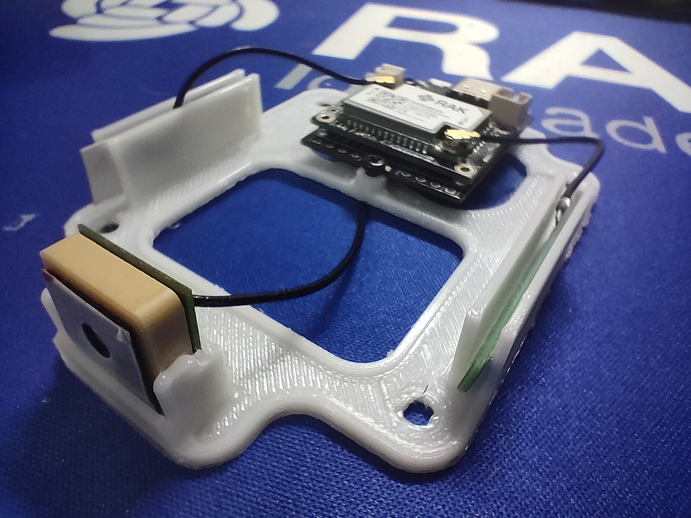
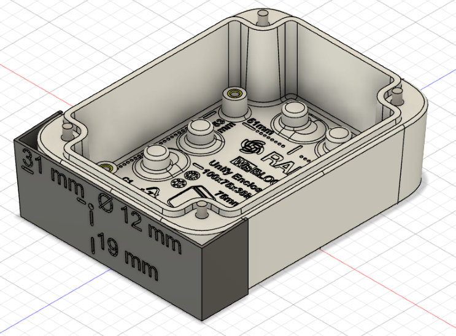
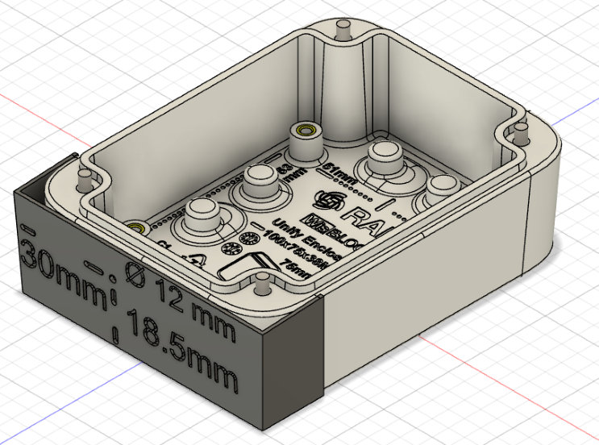
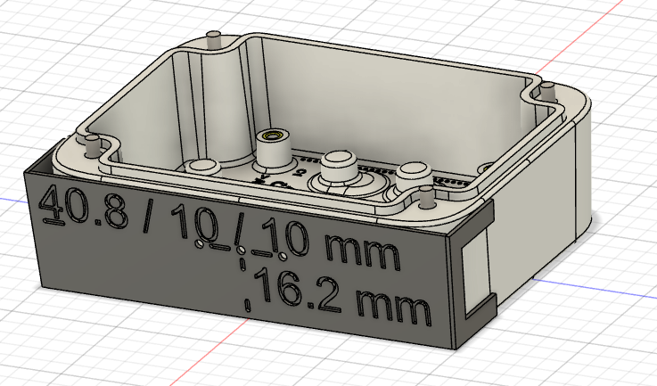
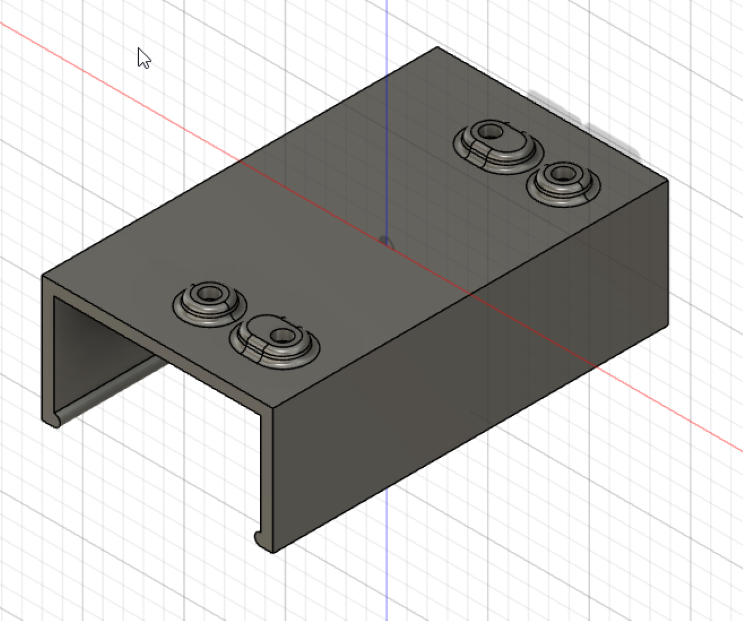
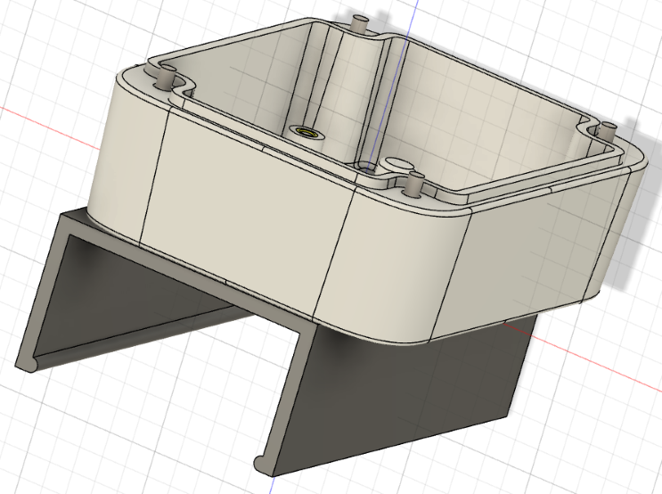
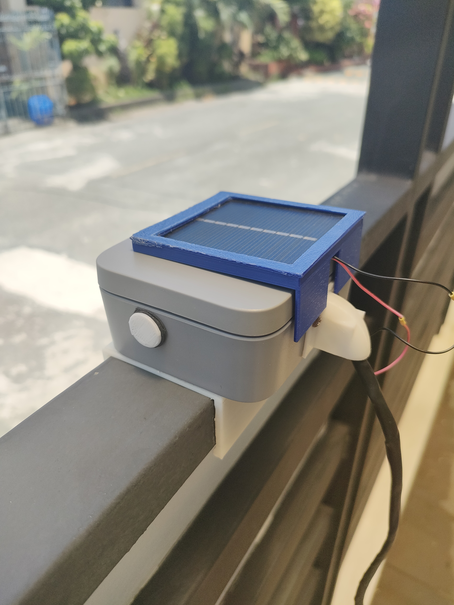

# Welcome to _**Awesome WisBlock Unify Enclosures**_ 

When you buy our awesome WisBlock Unify Enclosures, you can select matching mounting plates to mount your WisBlock Base Board and modules in the enclosures.    

But as usual, that's not where we stop .    
Often you need your very special mounting plate, be it to fix a battery or your antenna.    

To make it easier for you, we share here some ideas for mounting plates as well as blank plates that you can use as a template to create your own design.

----

**Content**     
- [Small Unify Enclosure](#small-unify-enclosure)
   - [Blank Base](#small-blank-base)
   - [GNSS location tracker base](#gnss-location-tracker-base)
   - [Helpers for customization](#helpers-for-customization)
- [Medium Unify Enclosure](#medium-unify-enclosure)
   - [Blank Base](#medium-blank-base)

----

# Small Unify Enclosure

----

## Small Blank Base
If you want to create your custom mounting plate, this empty mounting plate with the correct dimensions and mounting holes will help you. Download the [Step](./Small-Unify-Enclosure/Small-Blank.step) or [STL](./Small-Unify-Enclosure/Small-Blank.stl) to start.

----

## GNSS location tracker base
I prefer to have the GNSS antenna fixed to the mounting plate instead of glueing it to the enclosure wall. Here is a mounting plate with a place for the GNSS antenna and as well the LoRa and Bluetooth antenna on the sides. Download the [Step](./Small-Unify-Enclosure/Unify-GNSS.stp) or [STL](./Small-Unify-Enclosure/Unify-GNSS.stl) to start.

|  |  |
| -- | -- |
|  |  |

----

## Helpers for customization

The enclosures come originally without any holes for, e.g., the USB port access. To get the right positions for drilling some holes, I created helpers that make it easier to mark the right positions for USB holes or centered gland or antenna mounting holes on the Unify enclosure. 
As the Unify enclosure has a unique system for mounting accessories, there is as well a basic DIY mounting accessory available that can be used as a template. The template was used to create a clamp that holds the Unify enclosure save on a 2x4" steel pipe in my front yard.
You can download the Step or STL files from this repository:

| Type | Step | STL |
| -- | -- | -- |
| USB for RAK5005-O | [Step](./Small-Unify-Enclosure/Drill-Guide-USB-Micro-Hole.step) | [STL](./Small-Unify-Enclosure/Drill-Guide-USB-Type-C-Hole.stl) |     
| USB for RAK19003 and RAK19007 | [Step](./Small-Unify-Enclosure/Drill-Guide-USB-Type-C-Hole.step) | [STL](./Small-Unify-Enclosure/Drill-Guide-USB-Type-C-Hole.stl) |    
| Gland / antenna mount | [Step](./Small-Unify-Enclosure/Drill-Guide-Gland-Hole.step) | [STL](./Small-Unify-Enclosure/Drill-Guide-Gland-Hole.stl) | 
| Mounting accessory template | [Step](./Small-Unify-Enclosure/Mounting-Template.step) | [STL](./Small-Unify-Enclosure/Mounting-Template.stl) | 

| USB C type (RAK19003/RAK19003) | Micro USB type (RAK5005-O) |
| -- | -- |
|  |  |
| Gland / Antenna | Mounting template |
|  |  |
| Mounting template | Mounting template |
|  |  |

----

# Medium Unify Enclosure

## Medium Blank Base

At this time we have only the blank mounting plate as 3D file available. But over time I will add more ideas here.

Download the [Step](./Medium-Unify-Enclosure/Medium-Blank.step) or [STL](./Medium-Unify-Enclosure/Medium-Blank.stl) to start.

----

Thank you for sharing your _**awesome**_ ideas here and supporting RAKwireless by using our WisBlock products.    

**RAKwireless invests time and resources providing this open source code, please support RAKwireless and open-source hardware by purchasing products from [RAKwireless](https://rakwireless.com/)!**

_**For support and questions about RAKwireless products please visit our [forum](https://forum.rakwireless.com/)**_    
_**For examples and quick start tutorial please visit our [Github Repo](https://github.com/RAKWireless/Wisblock)**_    
_**For additional information about RAK products please visit our [Documentation Center](https://docs.rakwireless.com/) and our [Knowledge Hub](https://docs.rakwireless.com/Knowledge-Hub/Learn/)**_    
_**To buy WisBlock modules please visit our [online store](https://store.rakwireless.com/)**_    