| 

 | 

 |
| --- | --- |

The Unify Enclosures are perfect outdoor enclosures with IP67. But if you want to measure air quality data and need some air-flow through the enclosure, some customization is required.

As a PoC, far from being perfect, I converted two Unify enclosures into outdoor air quality devices.    

The usual solution would be to use the air permeable membranes, but as I was not sure how they would work for CO2, VOC and particulate matter, I looked for another solution.

My idea was to add air-channels to the outside of the Unify enclosure, protecting openings in the enclosure from rain and water-splash.    
| 

 | 
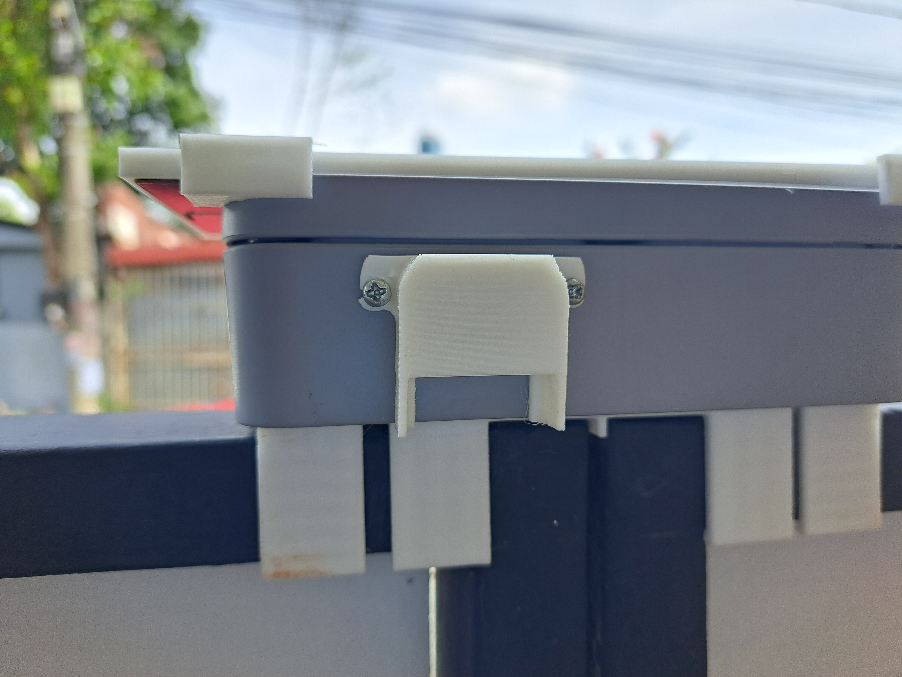
 |
| --- | --- |

These air-channels are not perfect, as they will not prevent water to go into the enclosure when it is submerged or when water is splashing upwards from the ground into the channels. But for the way I mounted my enclosures, they work quite well and have already survived multiple heavy tropical rainstorms here in the Philippines.    

Beside of the 3D data of the air-channels, I share here as well the custom internal mounting plates and mounting clips for the enclosure. I mounted both enclosures on the 1x2" steel bars of my front fence.    
For the mounting clips, I used the existing mounting preparations on the bottom of the Unified enclosures.    

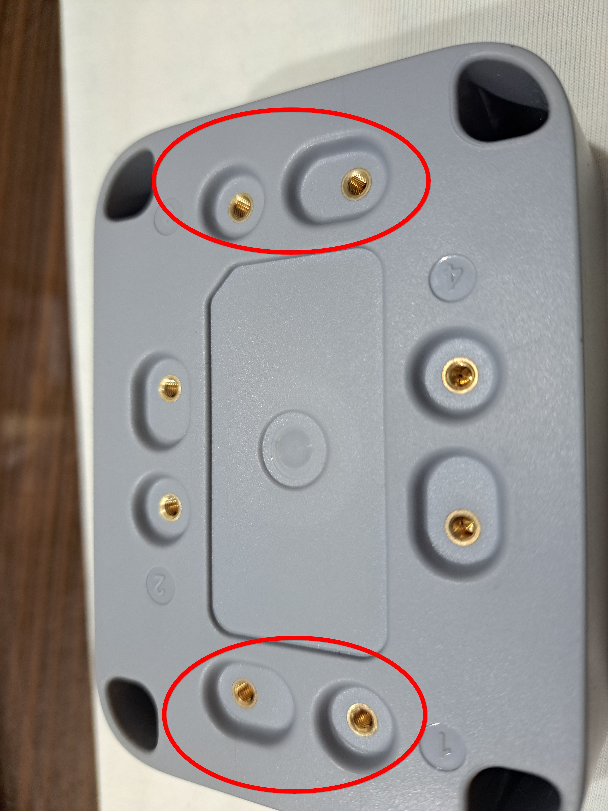

# Outdoor Small CO2 sensor

The first PoC is based on the small enclosure, with two round inlets. In the first prototype, I used existing holes, that's why they are located on a long and a short wall. In the design files both air inlets are on the long walls.    

This sensor is using 
- RAK19007 Base Board
- RAK4631 Core Module
- RAK1901 Temperature 
- RAK12037 CO2 Sensor Module

## Available 3D design files
All custom components are available as 3D files in different formats

- 3D manufacturer files => .3mf 
- Fusion360 files => .3fd or .3fz
- Sketchup files => .skp
- Object files => .zip
- Step files ==> .step

The files are located in different folders:
- [Air inlet](./Small-Air-Inlet-Down/)
- [Bespoke Plate for the BaseBoard](./Small-Bespoke-Base/)
- [Bespoke Plate for the Sensor](./Small-Bespoke-Sensor/)
- [Drill helpers](./Small-Drill-Helper/)

## Details

The WisBlock Base Board is in this case mounted below the Bespoke Plate to gain more space for the sensor and a better airflow.    

| 
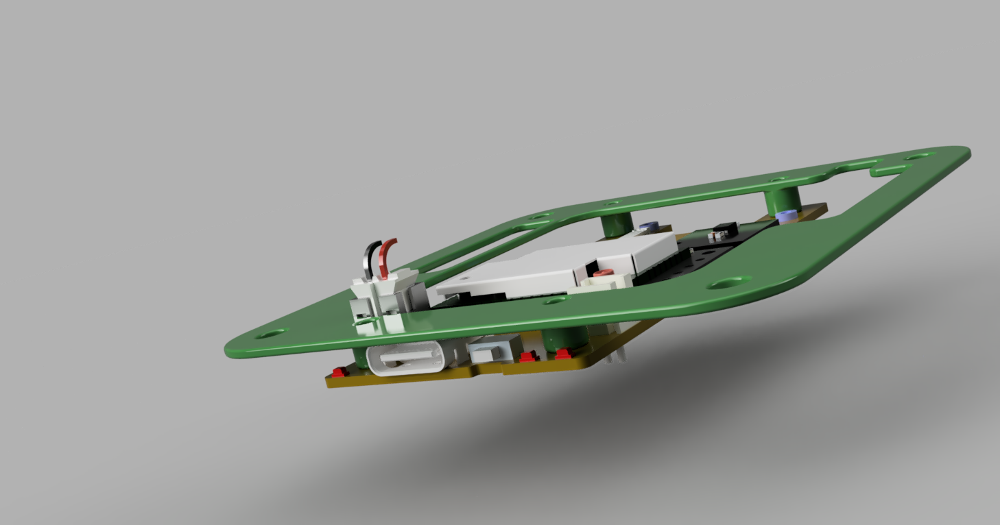
 | 
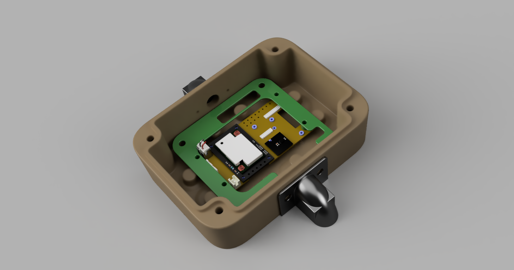
 |
| --- | --- |

The RAK12037 sensor is placed on a second Bespoke Plate. I choose to make two Bespoke Plates, because this was easier for 3D printing. If a better 3D printer (like SLS) is used, the two Bespoke Plates could be combined to a single one.

| 
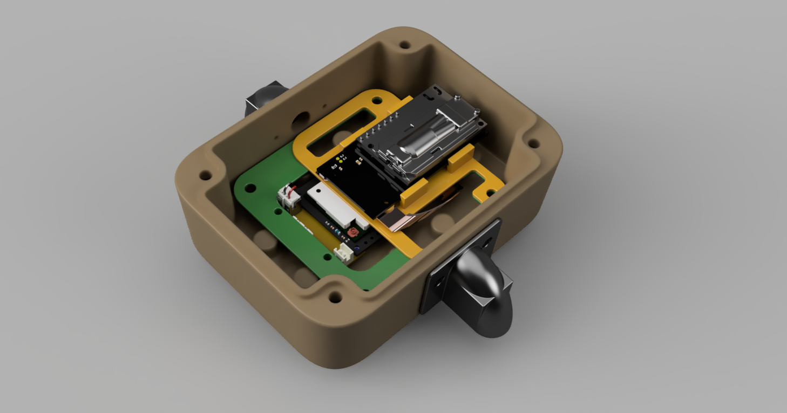
 | 
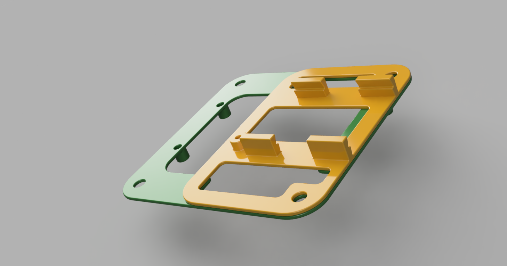
 |
| --- | --- |

As the sensor is not plugged directly to the IO slot of the WisBlock Base Board, the RAK19008 IO FPC extension is used to connect the two.

| 
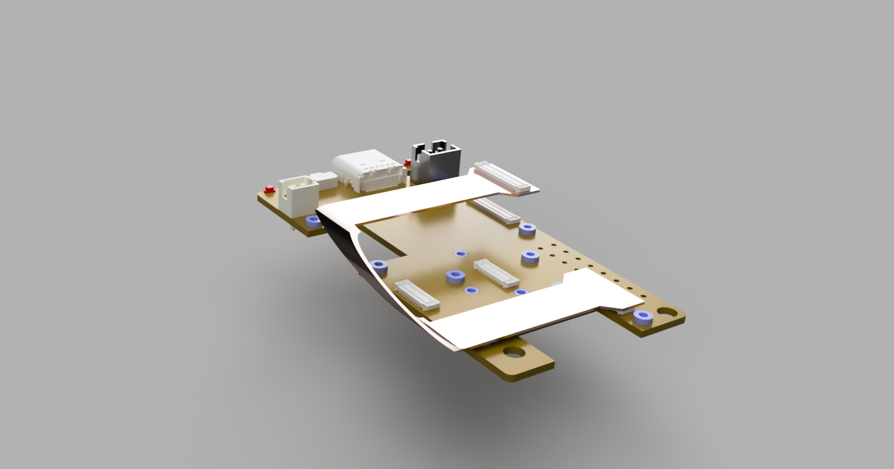
 | 
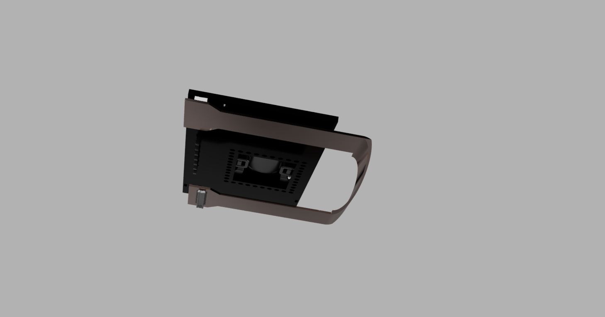
 |
| --- | --- |

The Air Inlet itself is a like a bended hose to give better protection against water splash. For easier DIY work, a drill guide is available as well.

| 
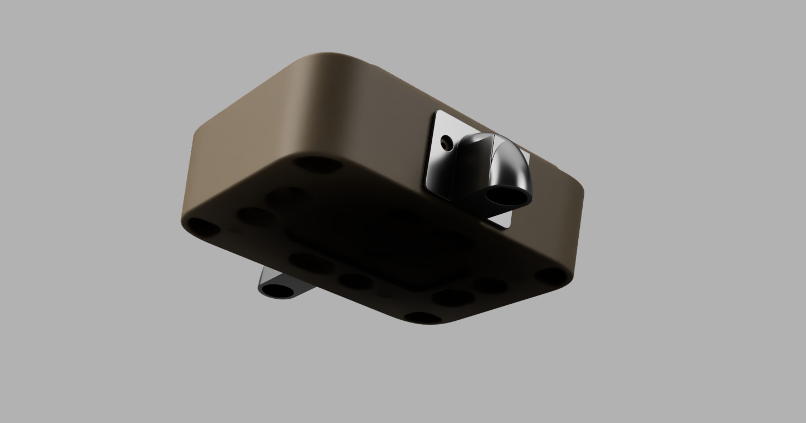
 |
| --- |

| 

 | 
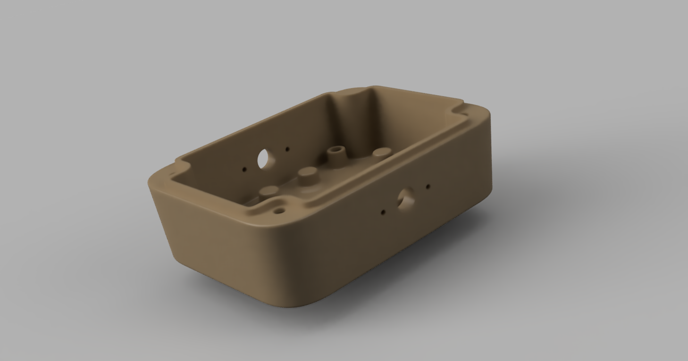
 |
| --- | --- |

In the tests I placed the sensor on the 1x2" steel bar of our front fence. For this I needed some custom clips for the Unify Enclosure. The 3D design for these clips are as well available as 3D designs.

| 
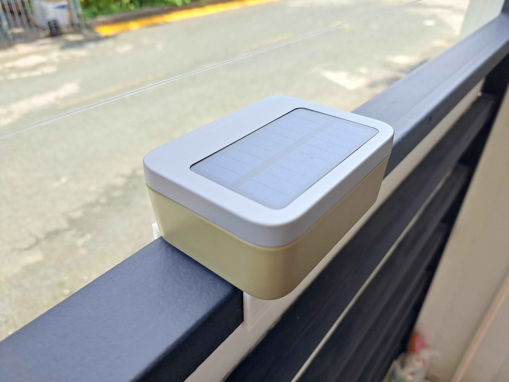
 | 
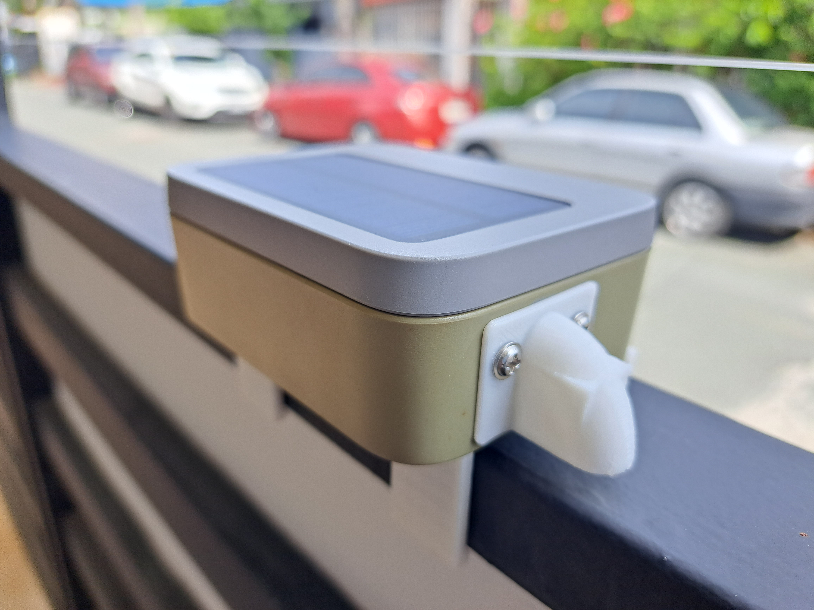
 |
| --- | --- |
| 

 | 

 |

# Outdoor Medium Air Quality Sensor

This PoC is using more sensors to measure different values that can define the air quality. Beside of the CO2 and temperature & humidity sensor, this device has as well a particulate matter (PM) sensor and a volatile organic components (VOC) sensor.

Due to the size required for all the sensors, the medium Unify Enclosure is used for this device.    

This sensor is using 
- RAK19001 Base Board
- RAK4631 Core Module
- RAK1901 Temperature 
- RAK12037 CO2 Sensor Module
- RAK12039 PM Sensor Module
- RAK12047 VOC sensor

## Available 3D design files
All custom components are available as 3D files in different formats

- 3D manufacturer files => .3mf 
- Fusion360 files => .3fd or .3fz
- Sketchup files => .skp
- Interchange files => .ipt
- Step files ==> .step

The files are located in different folders:
- [Air inlet](./Medium-Air-Inlet-Down/)
- [Bespoke Plate for the BaseBoard](./Medium-Bespoke/)
- [Bespoke Plate for the Battery](./Medium-Battery-Mount/)
- [Drill helpers](./Medium-Drill-Helper/)
- [PM Sensor Carrier](./Medium-PM-Sensor-Carrier/)

## Details

To be able to place the PM sensor, a custom Bespoke Plate is used here as well. The "standard" PM sensor RAK12039 comes without a proper mounting option, so for this case I designed as well a carrier for the RAK12039. This carrier can be screwed to the custom Bespoke Plate.
The PM sensor has a small fan that guaranties an air flow through the enclosure.    

| 
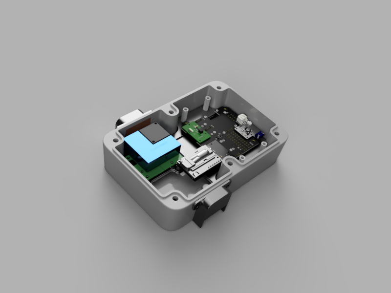
 | 
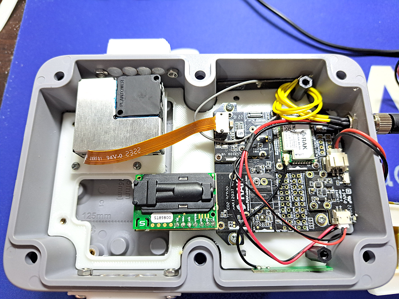
 |
| --- | --- |

The PM sensor RAK12039 can be screwed on the Bespoke Plate with it's carrier.    
For mounting of the device on the fence, some custom designed clips are used.        

| 
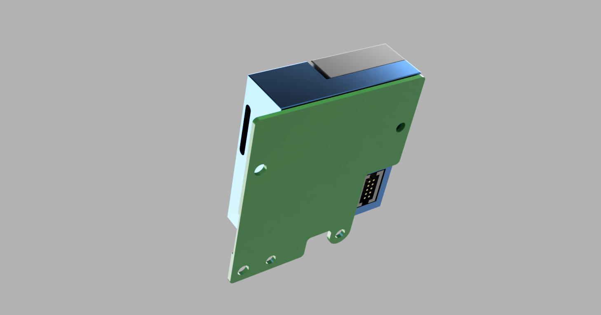
 | 
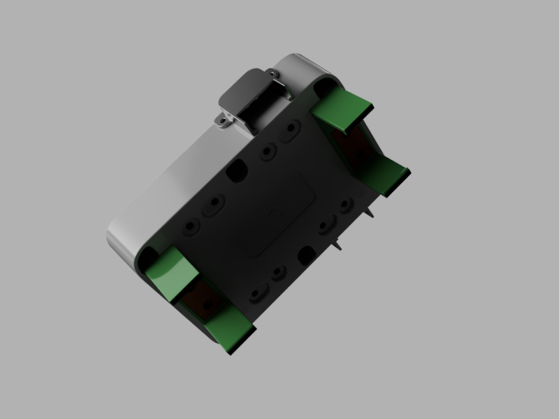
 |
| --- | --- |

Same as for the small enclosures, drill helpers are included to place the holes for the air inlets. In this design the opening for the air is larger, this is required for the fan of the PM sensor.    
As an idea to protect against insects, a small mesh could be placed behind the holes in the enclosure.    

| 

 | 

 |
| --- | --- |
| 

 | 
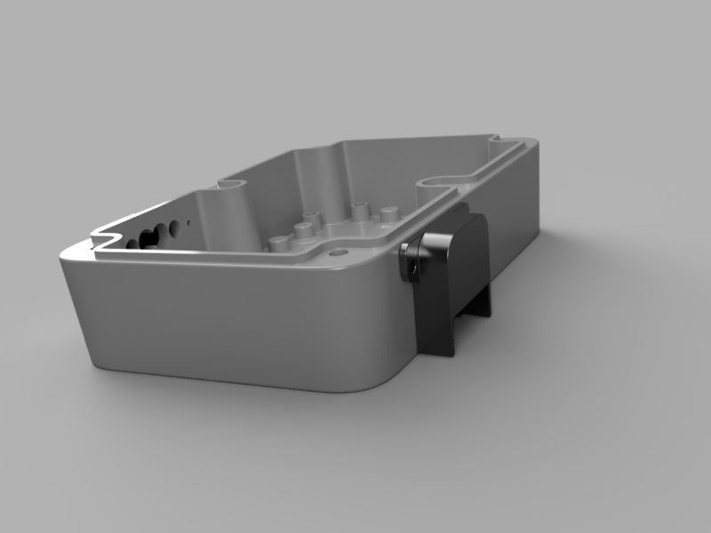
 |
| 
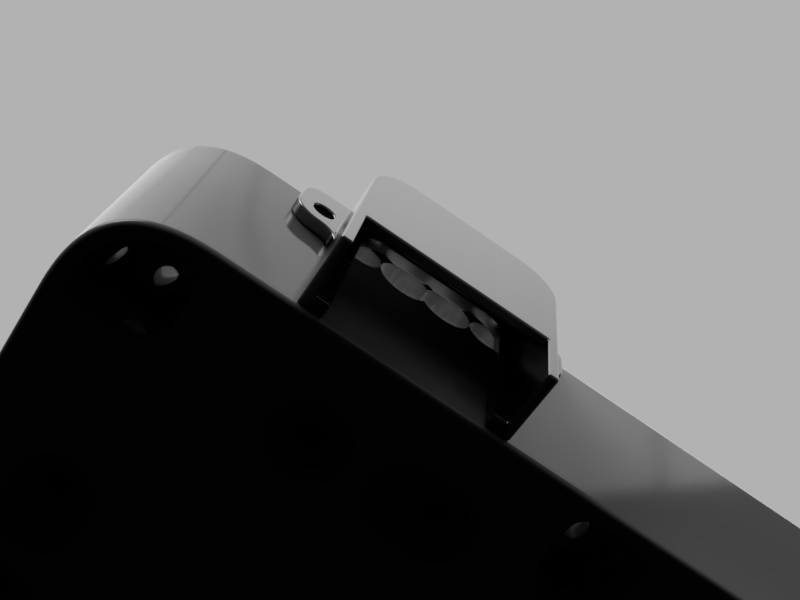
 | 
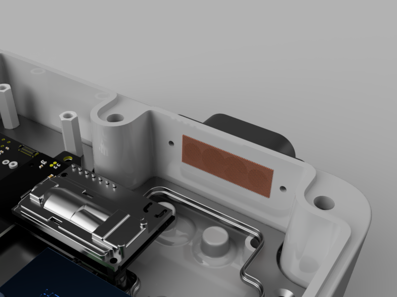
 |

In the tests I placed the sensor on the 1x2" steel bar of our front fence. For this I needed some custom clips for the Unify Enclosure. The 3D design for these clips are as well available as 3D designs.

| 
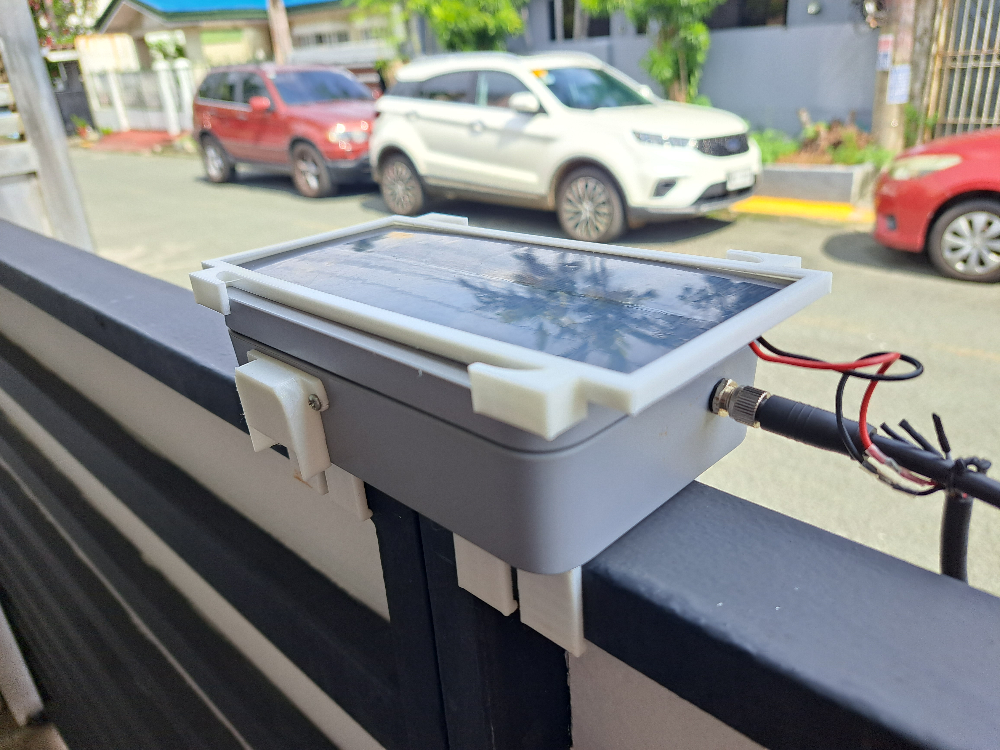
 | 

 |
| --- | --- |
| 

 | 

 |

https://github.com/RAKWireless/Awesome-WisBlock/assets/512690/1a7c92b2-3e90-4afe-b32e-b8c4dce32c05
