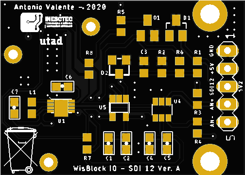
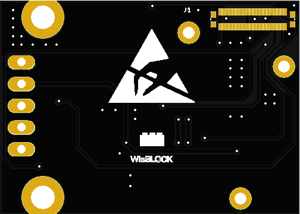

# WisBlock IO - SDI-12 Module

This module was created to connect to **SDI-12 sensors**. 

Many of the sensors used in agriculture use the SDI-12 communication protocol. The protocol uses only three lines, two supply and one, bi-directional, for data communication in a master-slave mode (the sensor element is slave). More details of the protocol [here](http://www.sdi-12.org/).

## SDI-12 block

The SDI-12 block is composed of a single inverting buffer driver ([74LVC1G240](https://www.ti.com/product/SN74LVC1G240)) with 3-state output to send data from the WisBlock serial port (`TXD1`). Data them goes throught a protection block a reaches the SDI12 data line (`SDI12_DATA`). Data from SDI12 data line, after pass the protection block, is inverted and level shifted by a simple MOSFET and feeds the serial port (`RXD1`).

The port pins used are:
| WisBlock IO connector PIN | Meaning |
| :--: | :--: |
| `TXD1` | Serial Port TxD data |
| `RXD1` | Serial Port RxD data |
| `IO4`  | Trasmition/Reception Selector |

## 5V DC-DC Converter

Although in the protocol the supply is 12V, most sensors used in agriculture work with a 5V supply (eg the [Meter Group](https://www.metergroup.com/environment/products/)'s ATMOS, TEROS and ECHO20 sensors). Thus, the design solution was to implement a 5V DC/DC converter with extremely low quiescent current consumption ([ISL9122A](https://www.renesas.com/in/en/products/power-management/switching-regulators/integrated-fet-regulators/device/ISL9122A.html) from Renesas). 

The port pins used are:
| WisBlock IO connector PIN | Meaning |
| :--: | :--: |
| `I2C1_SDA` | I2C SDA pin |
| `I2C1_SCL` | I2C SCL pin |
| `IO5`  | Enable/Disable 5V |

## 18-bit ADC

An 18-bit analog channel ([MCP3421](https://www.microchip.com/wwwproducts/en/en520011) from Microchip) for sensors such as Irrometer's [Watermark](https://www.irrometer.com/sensors.html#wm) and PinoTech's [SoilWatch 10](https://pino-tech.eu/soilwatch10/) has also included.

The port pins used are:
| WisBlock IO connector PIN | Meaning |
| :--: | :--: |
| `I2C1_SDA` | I2C SDA pin |
| `I2C1_SCL` | I2C SCL pin |

## Important Remarks

The module 3V3 power is from the WisBlock switched power, `3V3_S`, to power off the module for low power comsumption. Also, the used DC/DC converter has extremely low quiescent current consumption and can be shutdown by the WisBlock pin (`IO5`) - same pin used in the RAK1920 IO module for shutdown the 5V DC/DC conveter.

The used DC/DC convert has three operation modes:
| Operation Mode | Habilitation | Quiescent Current Consumption |
| :--: | :--: | :--: |
| Regulation | EN=1 or `IO5`=1 | 1300 nA |
| Forced Bypass | I2C selected | 120nA  |
| Shutdown | EN=0 or `IO5`=0 | 8 nA |
 

 ## WisBlock IO SDI-12 PCB
| TOP | BOTTOM |
| :--: | :--: |
|  |  |     
