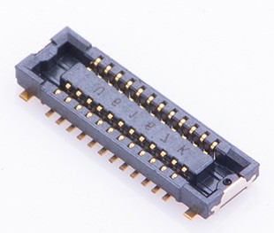

# Welcome to _**Awesome WisBlock Modules**_ 

[RAKwireless WisBlock](https://docs.rakwireless.com/Product-Categories/WisBlock/) is open source. Not only the software is open source, but the hardware is as well.

To support you, we created the _**Awesome WisBlock**_ repository. Here you find tutorials how to create your own **WisBlock Sensor** or **WisBlock IO** modules.    

     

If you have created your own awesome IO or Sensor module, please share it here with the **WisBlock** community and become a **RAKstar**. And if it is something real awesome, **RAKwireless** might even produce it.

----

**Content**
- [Read this first](#read-this-first)
- [WisBlock Sensor tutorial](#wisblock-sensor-tutorial)
- [WisBlock IO tutorial](#wisblock-io-tutorial)
- [Board-to-boardconnectors](#board-to-board-connectors)
   - [Connector data sheets](#connector-data-sheets)
   - [Connector part library](#connector-part-library)
- [RAK examples](#rak-examples)
   - [RTC example](#rtc-example)
   - [IO extender example](#io-extender-example)
- [Community created modules](#community-created-modules)
   - [WisBlock SDI12 Module](../WisBlock-Modules/WisBlock-IO-Modules/WisBlock-SDI12-Module)

----

## Read this first
- The board-to-board connectors used in the **WisBlock** products can be bought from the [RAKwireless store](https://store.rakwireless.com). There are two suppliers for the connectors, Panasonic and TXGA. On the base board (RAK5005-O) are the female/socket version, on the modules are the male/header version      
- Have a good look into the datasheet of the **RAK5005-O WisBlock Base** board to understand the signals connected to the 4 sensor slots. => [RAK5005-O datasheet](https://docs.rakwireless.com/Product-Categories/WisBlock/RAK5005-O/Datasheet/)    
- Have a good look into the datasheet of one of the existing **WisBlock Sensor** modules to understand the usage of the signals. For example the [RAK1906 Environment sensor](https://docs.rakwireless.com/Product-Categories/WisBlock/RAK1906/Datasheet/)    
- Have a good look into the datasheet of one of the existing **WisBlock IO** modules to understand the usage of the signals. For example the [RAK1920 Sensor Adapter](https://docs.rakwireless.com/Product-Categories/WisBlock/RAK1920/Datasheet/)    

----

## WisBlock Sensor tutorial
This tutorial leads you throught the steps to create your own **WisBlock Sensor** module. You can find the step-by-step tutorial _**[here](../WisBlock-Modules/WisBlockSensorTutorial.md)**_    
To make the task easier, we have prepared a complete example project for Autodesk Eagle™. You can download it [here](../WisBlock-Modules/WisBlock-Sensor-Template.zip).

## WisBlock IO tutorial
This tutorial leads you throught the steps to create your own **WisBlock IO** module. You can find the step-by-step tutorial _**[here](../WisBlock-Modules/WisBlockIOTutorial.md)**_    
To make the task easier, we have prepared a complete example project for Autodesk Eagle™. You can download it [here](../WisBlock-Modules/WisBlock-IO-Template.zip).    

Thanks to RAKstar psupine we have now the example project for KiCad. Thank you very much for your contribution. You can download the [KiCad project here](./WisBlock-IO-Template-KiCad.zip)

Thanks to RAKstar @antoniovalente we have as well an SDI12 module available.

## Board-to-board connectors
| 24 Pin Male | 24 Pin Female |
| :--: | :--: |
|  |  |     

The board-to-board connectors used in the WisBlock products can be bought from the [RAKwireless store](https://store.rakwireless.com). There are two suppliers for the connectors, Panasonic and TXGA. On the base board (RAK5005-O) are the female/socket version, on the modules are the male/header version.      
There are two types of connectors. The 24pin male connector is used for WisBlock Sensor modules. The 40pin male connector is used for WisBlock IO modules.    
| 40 Pin Male | 40 Pin Female |
| :--: | :--: |
|  |  |    

### Connector data sheets
   - Panasonic connector [data sheet](https://industry.panasonic.eu/productfinder?mode=FILTER_MODE&search=&group=Connectors&sort=&category=Connectors&lineup=Narrow+pitch+connector&series=A4S%280.4mm+pitch%29)    
   - TXGA connector [data sheet](https://txga.com/search.html?keyword=FBB04)    

### Connector part library
Due to strict rules of [Component Search Engine](https://componentsearchengine.com) we cannot offer the ready to use libraries for download.  
  
You can get the libraries from these links, but you will have to register at _Component Search Engine_ to do so.  

     
Link to [24 pin Connector for Sensor Slot](https://componentsearchengine.com/part.php?partID=12868517)    
     
Link to [40 pin Connector for IO Slot](https://componentsearchengine.com/part.php?partID=12868607) 

## RAK examples
We prepared a custom **WisBlock Sensor** and a custom **WisBlock IO** module as ready to go Eagle™ projects.

### RTC example
This Eagle™ project is the outcome of the **WisBlock Sensor** tutorial. It is a RTC module with integrated backup battery.

### IO extender example
This Eagle™ project is the outcome of the **WisBlock IO** tutorial. It is an IO extender that gives you access to more GPIO's.

## Community created modules
This is your space. We hope that you share the _**awesome**_ **WisBlock Sensor** and **WisBlock IO** you created here with the community.    

----
### Mini IO extender 10x23mm footprint
https://github.com/piecol/Wisblock_IO_extention_10x23/

----

Thank you for sharing your _**awesome**_ creation here and supporting RAKwireless by using our WisBlock products.    

**RAKwireless invests time and resources providing this open source code, please support RAKwireless and open-source hardware by purchasing products from [RAKwireless](https://rakwireless.com/)!**

_**For support and questions about RAKwireless products please visit our [forum](https://forum.rakwireless.com/)**_    
_**For examples and quick start tutorial please visit our [Github Repo](https://github.com/RAKWireless/Wisblock)**_    
_**For additional information about RAK products please visit our [Documentation Center](https://docs.rakwireless.com/) and our [Knowledge Hub](https://docs.rakwireless.com/Knowledge-Hub/Learn/)**_    
_**To buy WisBlock modules please visit our [online store](https://store.rakwireless.com/)**_    
