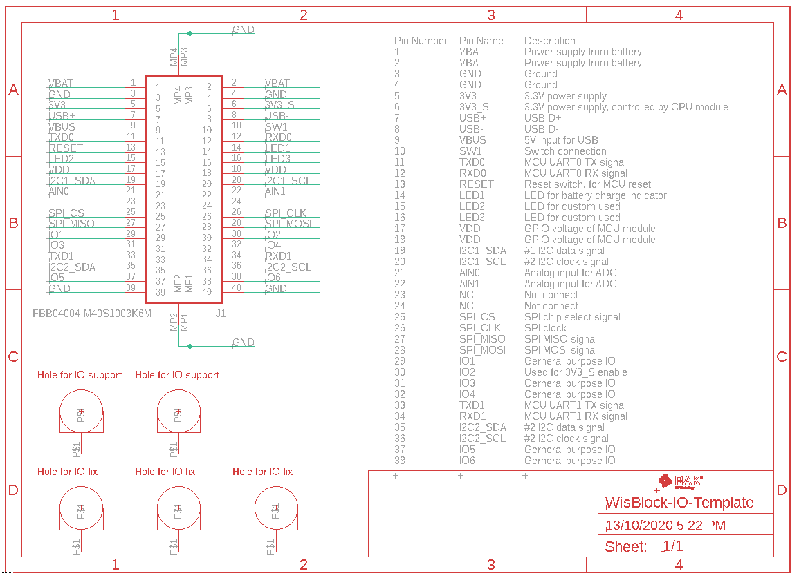
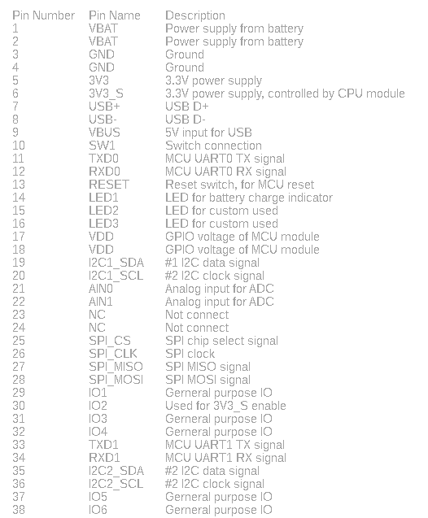
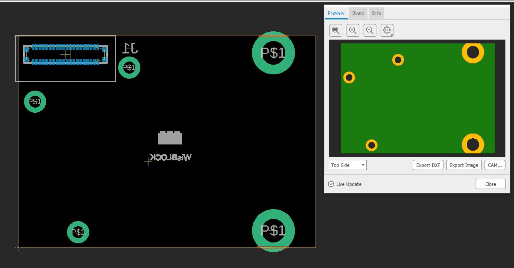
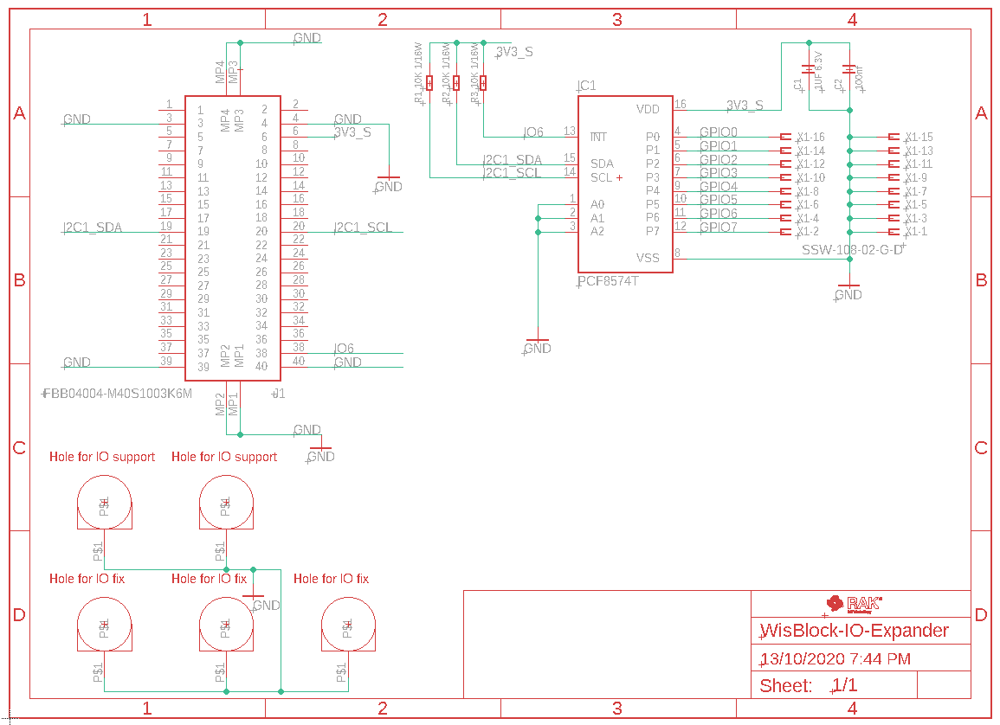
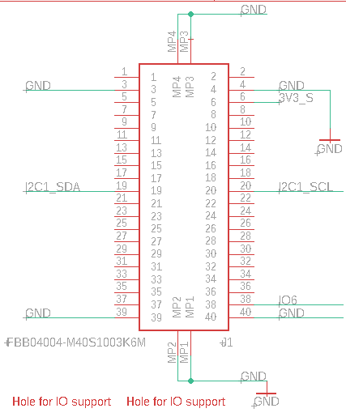
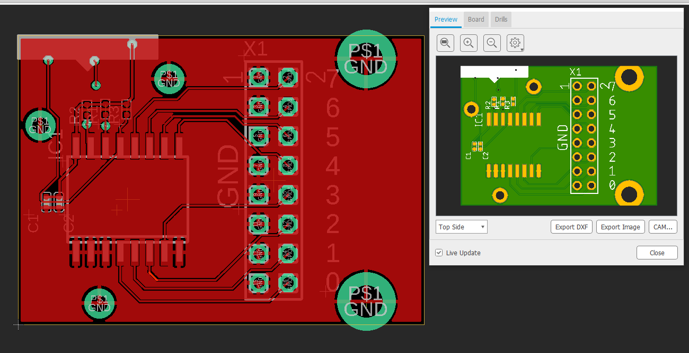
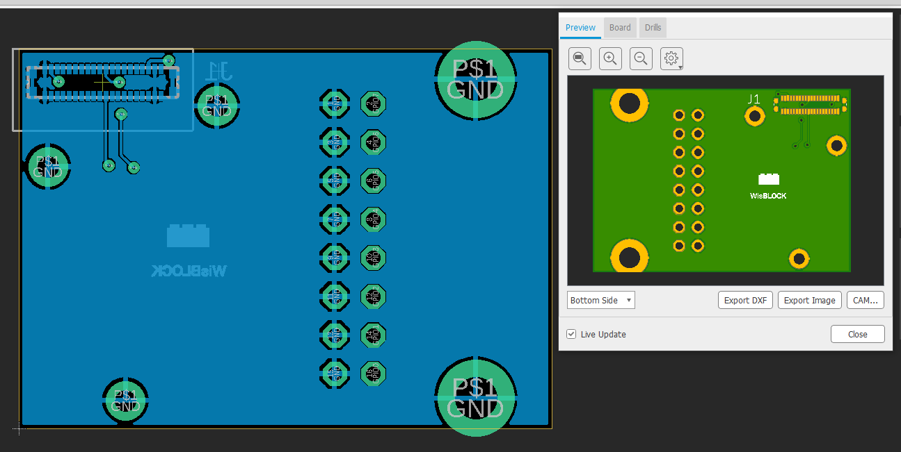

# Make your own WisBlock IO board

**Content**
- [Read first](#Read-this-first)
- [Autodesk Eagle™ template](#template-project)
   - [Template schematic](#template-schematic)
   - [Template PCB](#template-pcb)
- [IO Expander example](#io-expander-example)
   - [IO Expander Example schematic](#io-expander-example-schematic)
   - [IO Expander Example PCB](#io-expander-example-pcb)
- [Conclusion](#conclusion)    

Even though, RAKwireless is offering a wide selection of WisBlock IO modules, you might not have found the one you need.    
In this small tutorial I want to show you how to make your own WisBlock IO Expander module.     

## Read this first
- The board-to-board connectors used in the WisBlock products can be bought from the [RAKwireless store](https://store.rakwireless.com). There are two suppliers for the connectors, Panasonic and TXGA. On the base board (RAK5005-O) are the female/socket version, on the modules are the male/header version      
   - Panasonic connector [data sheet](https://www.panasonic-electric-works.com/pew/eu/downloads/ds_a4s_en.pdf)    
   - TXGA connector [female data sheet](https://tupian.txga.com/serials-attach/FBB04004-F/Drawing-FBB04004-F.pdf)    
   - TXGA connector [male data sheet](https://tupian.txga.com/serials-attach/FBB04004-M/Drawing-FBB04004-M.pdf)
- Schematic and PCB part libraries for other PCB design tools than Eagle are available in the [Parts-Libraries](./PartsLibraries) 
- Have a good look into the datasheet of the RAK5005-O WisBlock Base board to understand the signals connected to the 4 sensor slots. => [RAK5005-O datasheet](https://docs.rakwireless.com/Product-Categories/WisBlock/RAK5005-O/Datasheet/)    
- Have a good look into the datasheet of one of the existing WisBlock IO modules to understand the usage of the signals. For example the [RAK1920 IO Extension](https://docs.rakwireless.com/Product-Categories/WisBlock/RAK5804/Datasheet/)    

## Template project
To make the task easier, we have prepared a complete example project for Autodesk Eagle™. You can download it [here](./WisBlock-IO-Template.zip). The project has everything you need to start your own WisBlock IO module. It includes the board-to-board connector used on WisBlock IO modules and a predefined PCB shape, matching the original WisBlock IO modules with the holes to fix the module to the WisBlock Base board.

### Template schematic
The template schematic is very simple. It only includes the connector and a table that explains the assignment of the pins. All 38 pins of the connector are assigned to signals. 2 pins are unused    
    

### Important information about the pin assignments
A few things you need to know.
- VDD is the MCU's GPIO voltage, for a RAK4631 this would be 3.3V. It is available as long as your WisBlock is powered by USB or battery
- 3V3 is a 3.3V power supply that is available as long as your WisBlock is powered by USB or battery
- 3V3_S is a 3.3V power supply that can be controlled by the WisBlock Core module.    
- VBUS is the 5V from the USB connector. This supply is only available while the WisBlock is powered over USB.
- USB+ and USB- are the USB connection from the WisBlock Core module. These signals might not be available on all WisBlock Core modules
- I2C2_SDA and I2C2_SCL are not available on all WisBlock Core modules
- TXD1 and RXD1 are not available on all WisBlock Core modules 
If your IO module is consuming only a few uA current, you can choose VDD or 3V3 to power the electronic parts of your IO module. But if your module is consuming a higher current, it is **strongly** recommended to use 3V3_S as supply voltage. This way you can optimize power consumption of your WisBlock application by software.    

Check the table for more details:    

### Template PCB
The template PCB matches the size of standard WisBlock Sensor modules. Make sure not to move the connector (bottom side assembly) or the mounting holes that fixes the module on the WisBlock Base board

As you can see, Autodesk Eagle™ complains a lot of DRC dimension errors around the larger mounting whole. The mounting hole and its copper (connected to the GND signal) has to be mechanically located at the edge of the PCB. Autodesk Eagle™ allows only one design rule regarding distance to the PCB edges, hence the DRC errors.    
If you do not need the whole width (35mm) for your custom IO module, you can reduce the width and skip the two larger fixing holes on the right side. But make sure that your width covers at least the 3 smaller fixing holes on the left side.

### Important information about the PCB design
- As already said, _**NEVER MOVE THE CONNECTOR AND THE MOUNTING HOLE TO A DIFFERENT LOCATION**_. If you move them, your self-made WisBlock IO will not fit into a WisBlock Base module.
- Due to the location of the board-to-board connector close to the edge of the PCB, you might have to change the design rules to use 4mil connections, 4mil distance between copper and 0.2mm via diameters. It will depend on your design if it works with the default Autodesk Eagle™ design rules, but mostlikely the wires to the connector pads will not be routeable.
- We recommend a GND plane on top and bottom layer.
- Do not place components on the bottom layer. The space between the sensor module and the base board is only 1-2 mm.    

## IO Expander example
For this example I chose a very common chip, [PCF8574 GPIO expander](https://www.ti.com/lit/ds/symlink/pcf8574.pdf) chip. This chip is controlled over I2C and extends your GPIO count by 8 bi-directional GPIO's.    

### IO Expander example schematic
Let's have a look into the WisBlock IO expander schematic.    
        
The first thing to check is that we removed most connections from the board-to-board connector.     
    
Only the required nets are left.    
For the IO expander chip, we need only the supply nets, the I2C nets and 1 IRQ line. The design around the IO expander is taken from the datasheet of the [PCF8574 GPIO expander](https://www.ti.com/lit/ds/symlink/pcf8574.pdf).

### IO Expander example PCB
We were able to route the whole design on a two layer board. The connection was so simple, that it could be done with the Autodesk Eagle™ autorouter function.     
As you can see, we put the recommended GND planes on top and bottom. In addition the open copper area around the mounting hole is visible. This copper area is connected to the GND signal.
#### IO Expander top layer
    
#### IO Expander bottom layer
    

The Eagle files for the IO expander example PCB can be downloaded from [here](./WisBlock-IO-GPIO-Expander-Example.zip)
## Conclusion
As you can see it is not difficult to design a custom WisBlock IO module. Just follow the few design rules for the PCB design:    
- **DO NOT MOVE THE BOARD-TO-BOARD CONNECTOR FROM THE POSITION GIVEN IN THE TEMPLATE PCB**
- **DO NOT MOVE THE MOUNTING HOLES FROM THE POSITION GIVEN IN THE TEMPLATE PCB**
- Chose the right power supply for your sensor:
   - VDD or 3V3 if your current consumption is very low
   - 3V3_S if you need to control the power supply of your WisBlock Sensor module
- Do not place components on the bottom layer. The space between the sensor module and the base board is only 1-2 mm.    

I hope this small tutorial was useful. If you successfully designed your own WisBlock IO module, please share details in our forum section for [WisBlock](https://forum.rakwireless.com/c/wisblock/67).     
Thank you for reading this tutorial and supporting RAKwireless by using our WisBlock products.    

**RAKwireless invests time and resources providing this open source code, please support RAKwireless and open-source hardware by purchasing products from [RAKwireless](https://rakwireless.com/)!**

_**For support and questions about RAKwireless products please visit our [forum](https://forum.rakwireless.com/)**_    
_**For examples and quick start tutorial please visit our [Github Repo](https://github.com/RAKWireless/Wisblock)**_    
_**For additional information about RAK products please visit our [Documentation Center](https://docs.rakwireless.com/) and our [Knowledge Hub](https://docs.rakwireless.com/Knowledge-Hub/Learn/)**_    
_**To buy WisBlock modules please visit our [online store](https://store.rakwireless.com/)**_    