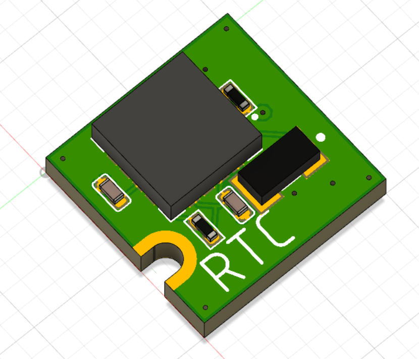
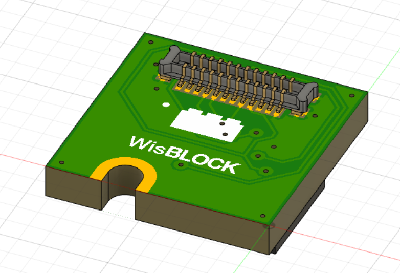
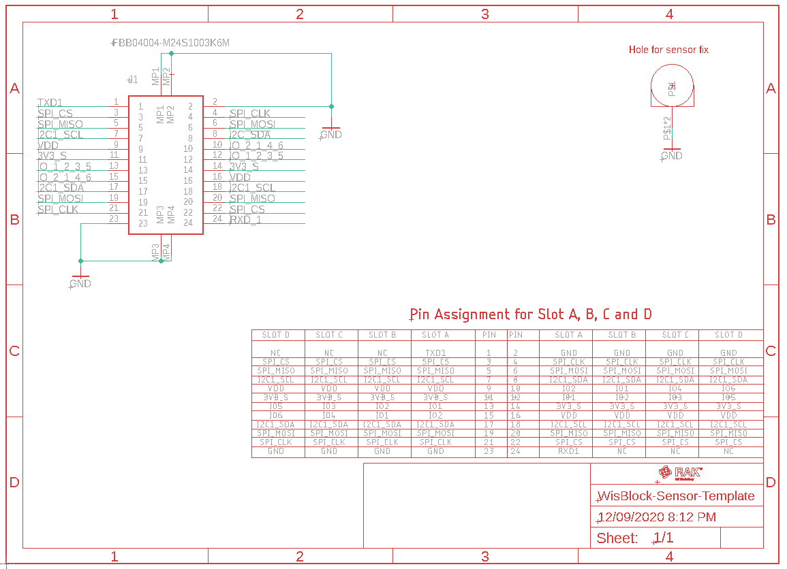
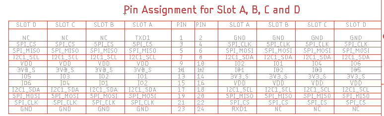
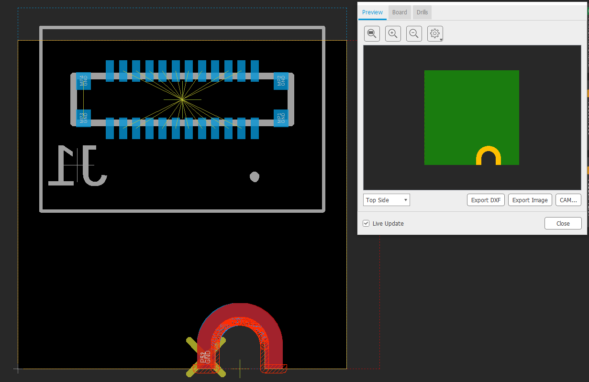
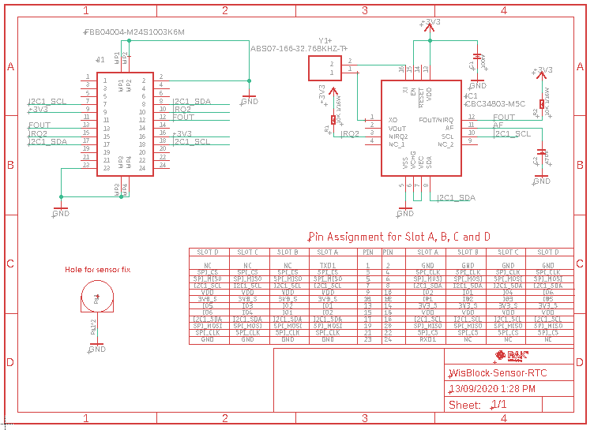
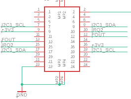
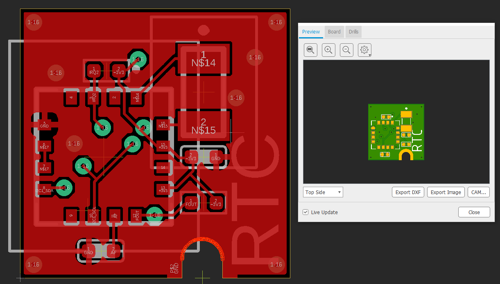
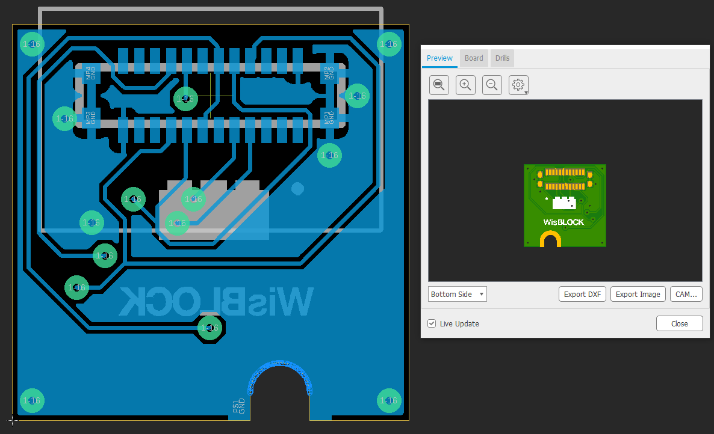

# Make your own WisBlock Sensor board

| Top view | Connector view |
| :-: | :-: |
|  |  |    

**Content**
- [Read first](#Read-this-first)
- [Autodesk Eagle™ template](#template-project)
   - [Template schematic](#template-schematic)
   - [Template PCB](#template-pcb)
- [RTC example](#rtc-example)
   - [RTC Example schematic](#rtc-example-schematic)
   - [RTC Example PCB](#rtc-example-pcb)
- [Conclusion](#conclusion)    

Even though, RAKwireless is offering a wide selection of WisBlock Sensor modules, you might not have found the one you need.    
In this small tutorial I want to show you how to make your own WisBlock Sensor RTC (real time clock) module.     

## Read this first
- The board-to-board connectors used in the WisBlock products can be bought from the [RAKwireless store](https://store.rakwireless.com). There are two suppliers for the connectors, Panasonic and TXGA. On the base board (RAK5005-O) are the female/socket version, on the modules are the male/header version      
   - Panasonic connector [data sheet](https://www.panasonic-electric-works.com/pew/eu/downloads/ds_a4s_en.pdf)    
   - TXGA connector [female data sheet](https://tupian.txga.com/serials-attach/FBB04004-F/Drawing-FBB04004-F.pdf)    
   - TXGA connector [male data sheet](https://tupian.txga.com/serials-attach/FBB04004-M/Drawing-FBB04004-M.pdf)
- Schematic and PCB part libraries for other PCB design tools than Eagle are available in the [Parts-Libraries](./PartsLibraries) 
- Have a good look into the datasheet of the RAK5005-O WisBlock Base board to understand the signals connected to the 4 sensor slots. => [RAK5005-O datasheet](https://docs.rakwireless.com/Product-Categories/WisBlock/RAK5005-O/Datasheet/)    
- Have a good look into the datasheet of one of the existing WisBlock Sensor modules to understand the usage of the signals. For example the [RAK1906 Environment sensor](https://docs.rakwireless.com/Product-Categories/WisBlock/RAK1906/Datasheet/)    

## Template project
To make the task easier, we have prepared a complete example project for Autodesk Eagle™. You can download it [here](./WisBlock-Sensor-Template.zip). The project has everything you need to start your own WisBlock Sensor module. It includes the board-to-board connector used on WisBlock Sensor modules and a predefined PCB shape, matching the original WisBlock Sensor modules with the small hole to fix the module to the WisBlock Base board.

### Template schematic
The template schematic is very simple. It only includes the connector and a table that explains the assignment of the pins. As you can see, the connector's pins are assigned in a way that you can rotate the sensor module by 180 degrees if necessary. All 24 pins of the connector are assigned to signals.    
    

### Important information about the pin assignments
A few things you need to know.
- VDD is a 3.3V power supply that is available as long as your WisBlock is powered by USB or battery
- 3V3_S is a 3.3V power supply that can be controlled by the WisBlock Core module.    
If you sensor module is consuming only a few uA current, you can choose VDD to power the electronic parts of your sensor. But if your module is consuming a higher current, it is **strongly** recommended to use 3V3_S as supply voltage. This way you can optimize power consumption of your WisBlock application by software.    

- SPI_MISO, SPI_MOSI, SPI_CLK, SPI_CS is for the SPI interface. We recommend not to use SPI on the WisBlock Sensor modules, but instead use I2C. Because the SPI_CS signal is the same on all sensor slots. Only one SPI module can be used on the sensor extension slots of the WisBlock Base board. A workaround could be to use one of the GPIO's available on the sensor slot for the SPI chip select signal.

- RXD1 and TXD1 are only available on slot A of the WisBlock Base board. If your sensor modules requires serial communication, make sure that it is only used in slot A. Also when using the serial signals, the module **cannot** be plugged in rotated without changes in the software application.

- Depending on the sensor slot the sensor module is plugged in, the connector pins 10, 12, 13 and 15 are connected to different GPIO's (IO1, IO2, IO3, IO4, IO5 and  IO6). If you plan to use any of these 4 pins for IRQ or control signals, you have to assign the correct GPIO in your application software.     

Check the table for more details:

### Template PCB
The template PCB matches the size of standard WisBlock Sensor modules. Make sure not to move the connector (bottom side assembly) or the mounting hole that fixes the module on the WisBlock Base board

As you can see, Autodesk Eagle™ complains a lot of DRC dimension errors around the mounting whole. The mounting hole and its copper (connected to the GND signal) has to be mechanically located at the edge of the PCB. Autodesk Eagle™ allows only one design rule regarding distance to the PCB edges, hence the DRC errors.

### Important information about the PCB design
- As already said, _**NEVER MOVE THE CONNECTOR AND THE MOUNTING HOLE TO A DIFFERENT LOCATION**_. If you move them, your self-made WisBlock Sensor will not fit into a WisBlock Base module.
- Due to the small size of the PCB (10x10mm), you might have to change the design rules to use 4mil connections, 4mil distance between copper and 0.2mm via diameters. It will depend on your design if it works with the default Autodesk Eagle™ design rules, but mostlikely the wires to the connector pads will not be routeable.
- We recommend a GND plane on top and bottom layer.
- Do not place components on the bottom layer. The space between the sensor module and the base board is only 1-2 mm.    

## RTC example
For this example I chose a very interesting RTC chip. It is the [EnerChip™ CBC34803-M5C](https://www.cymbet.com/products/enerchip-rtc/cbc34803-m5c/) RTC module made by [CYMBET Corp.](https://www.cymbet.com).    
The interesting part is that this _chip combines a Real-Time Clock (RTC) and calendar optimized for low power applications with an integrated rechargeable solid state backup battery and all power management functions._    
Yes, you read it correct. The chip has an integrated battery. A small one, agreed, it only provides backup of 5 days. But that is already quite good. And there is no need for a large coin battery or a large super capacitor to power the RTC during power down periods.    

### RTC example schematic
Let's have a look into the WisBlock Sensor RTC schematic.    
        
The first thing to check is that we removed most connections from the board-to-board connector.     
    
Only the required nets are left. If you do not remove the unused nets, you will struggle later on in the PCB design because of the mirrored assignement of the signals to the left and right connector row. There will be too many unnecessary connections just between the connector pins.    
For the RTC chip, we need only the supply nets, the I2C nets and 2 IRQ lines. The design around the RTC is taken from the datasheet of the [EnerChip™ CBC34803-M5C](https://www.cymbet.com/wp-content/uploads/2019/02/DS-72-34.pdf).

### RTC example PCB
We were able to route the whole design on a two layer board. The connection was so simple, that it could be done with the Autodesk Eagle™ autorouter function. Only one GND connection had to be added manually.     
As you can see, we put the recommended GND planes on top and bottom. In addition the open copper area around the mounting hole is visible. This copper area is connected to the GND signal.
#### RTC top layer
    
#### RTC bottom layer
    

The Eagle files for the RTC example PCB can be downloaded from [here](./WisBlock-Sensor-RTC-Example.zip)
## Conclusion
As you can see it is not difficult to design a custom WisBlock Sensor module. Just follow the few design rules for the PCB design:    
- **DO NOT MOVE THE BOARD-TO-BOARD CONNECTOR FROM THE POSITION GIVEN IN THE TEMPLATE PCB**
- **DO NOT MOVE THE MOUNTING HOLE FROM THE POSITION GIVEN IN THE TEMPLATe PCB**
- Chose the right power supply for your sensor:
   - VDD if your current consumption is very low
   - 3V3_S if you need to control the power supply of your WisBlock Sensor module
- Do not place components on the bottom layer. The space between the sensor module and the base board is only 1-2 mm.    

I hope this small tutorial was useful. If you successfully designed your own WisBlock Sensor module, please share details in our forum section for [WisBlock](https://forum.rakwireless.com/c/wisblock/67).     
Thank you for reading this tutorial and supporting RAKwireless by using our WisBlock products.    

| Top view | Connector view |
| :-: | :-: |
|  |  |   

**RAKwireless invests time and resources providing this open source code, please support RAKwireless and open-source hardware by purchasing products from [RAKwireless](https://rakwireless.com/)!**

_**For support and questions about RAKwireless products please visit our [forum](https://forum.rakwireless.com/)**_    
_**For examples and quick start tutorial please visit our [Github Repo](https://github.com/RAKWireless/Wisblock)**_    
_**For additional information about RAK products please visit our [Documentation Center](https://docs.rakwireless.com/) and our [Knowledge Hub](https://docs.rakwireless.com/Knowledge-Hub/Learn/)**_    
_**To buy WisBlock modules please visit our [online store](https://store.rakwireless.com/)**_    